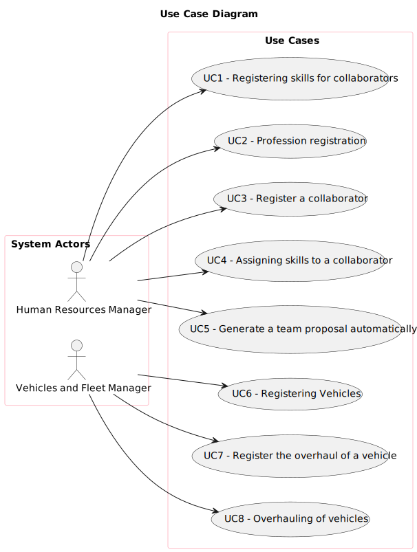

# Use Case Diagram (UCD)

# Use Cases / User Stories

| UC/US | Description                                                     |                   
|:------|:----------------------------------------------------------------|
| US001 | [Registering Skills](../../us001/Readme.md)                     |
| US002 | [Profession Registration](../../us002/Readme.md)                |
| US003 | [Register a collaborator](../../us003/Readme.md)                |
| US004 | [Assigning skills to a collaborator](../../us004/Readme.md)     |
| US005 | [Generate a team proposal automatically](../../us005/Readme.md) |
| US006 | [Registering Vehicles](../../us006/Readme.md)                   |
| US007 | [Register the overhaul of a vehicle](../../us007/Readme.md)     |
| US008 | [Overhauling of vehicles](../../us008/Readme.md)                |
