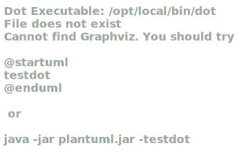

# OO Analysis

The construction process of the domain model is based on the client specifications, especially the nouns (for _concepts_) and verbs (for _relations_) used.

## Rationale to identify domain conceptual classes
To identify domain conceptual classes, start by making a list of candidate conceptual classes inspired by the list of categories suggested in the book "Applying UML and Patterns: An Introduction to Object-Oriented Analysis and Design and Iterative Development".

### _Conceptual Class Category List_

**Business Transactions**

* 

---

**Transaction Line Items**

* 

---

**Product/Service related to a Transaction or Transaction Line Item**

* 

---

**Transaction Records**

* 

---  

**Roles of People or Organizations**

* GSU : a person who uses the green spaces managed by the organization and who can through the Portal, make comments or report faults in parks and gardens on the Portal.
* GSM : the person responsible for managing the green spaces in charge of the organization.
* VFM : a person who manages the fleet park, the machines, equipment and vehicles, ensuring their good condition and assigning them to the tasks to be carried out.
* HRM :  a person who manages human resources and defines teams based on the needs of ongoing projects and the skills of the employees.
* Collaborator : a person who is an employee of the organization and carries out design, construction and/or maintenance tasks for green areas, depending on their skills.

---

**Places**

* Garden
* Medium-sized park
* Larged-sizes park

---

**Noteworthy Events**

* MusgoSublime, which is used by GSU and managed by GSM, manages green spaces. This system has collaborator who have a job and skills assigned to them which are registered by HRM.
  HRM also generates teams composed by collaborators. These teams have an agenda to follow defined by tasks. They also use vehicles (registered by VFM) who can transport equipment and machines.
  These vehicles need a periodical check-up (defined by VFM), the system informs the VFM of what vehicles need check-up, he may select the ones he wants and registers the overhauling.

---

**Physical Objects**

* Vehicle : device used for transporting people or goods from one place to another.
* Machine : device that uses energy to perform a specific task.
* Equipment : set of tools, utensils, or devices designed for a specific purpose, facilitating or enhancing the execution of activities or processes.

---

**Descriptions of Things**

* Task : responsibilities carried out occasionally or in a regular basis in a green space.
* Skill : has a unique name. They enable collaborators to perform certain tasks. They have to be registered so collaborators can be placed in a team.
* Job : has a unique name. Is the main occupation of a collaborator. A collaborator has a unique job.
* Agenda : is composed by tasks and is performed by a team.
* CheckUp : when a vehicle check-up is performed the licence, date and current mileage are registered.

---

**Catalogs**

* 

---

**Containers**

* 

---

**Elements of Containers**

* 

---

**Organizations**

* MusgoSublime :  is an organization dedicated to the planning, construction and maintenance of green spaces for collective use in their multiple dimensions.

---

**Other External/Collaborating Systems**

* 

---

**Records of finance, work, contracts, legal matters**

* 

---

**Financial Instruments**

* 

---

**Documents mentioned/used to perform some work/**

* Integrative Project Assignment (EN) - Versions 1 to 1.2 (to be updated)

---

## Rationale to identify associations between conceptual classes

An association is a relationship between instances of objects that indicates a relevant connection and that is worth of remembering, or it is derivable from the List of Common Associations:

- **_A_** is physically or logically part of **_B_**
- **_A_** is physically or logically contained in/on **_B_**
- **_A_** is a description for **_B_**
- **_A_** known/logged/recorded/reported/captured in **_B_**
- **_A_** uses or manages or owns **_B_**
- **_A_** is related with a transaction (item) of **_B_**
- etc.
    

| Concept (A) 		 | Association   	  | Concept (B) |
|---------------|:----------------:|------------:|
| MusgoSublime  |  manage    		 	  |         GreenSpace |
| GreenSpace  	 | is managed by		  |         GSM |
| GreenSpace  	 | is used by    		 |         GSU |
| GreenSpace  	 | managed    		 	  |         GSM |
| GreenSpace  	 | managed    		 	  |         GSM |
| GreenSpace  	 | managed    		 	  |         GSM |
| GreenSpace  	 | managed    		 	  |         GSM |
| GreenSpace  	 | managed    		 	  |         GSM |
| GreenSpace  	 | managed    		 	  |         GSM |
| GreenSpace  	 | managed    		 	  |         GSM |
| GreenSpace  	 | managed    		 	  |         GSM |
| GreenSpace  	 | managed    		 	  |         GSM |
| GreenSpace  	 | managed    		 	  |         GSM |
| GreenSpace  	 | managed    		 	  |         GSM |
| GreenSpace  	 | managed    		 	  |         GSM |
| GreenSpace  	 | managed    		 	  |         GSM |
| GreenSpace  	 | managed    		 	  |         GSM |
| GreenSpace  	 | managed    		 	  |         GSM |

## Domain Model

