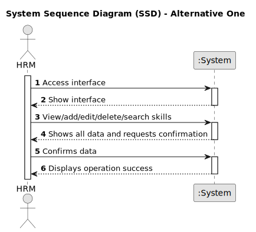

# US001 - Registering Skills for Collaborators

## 1. Requirements Engineering

### 1.1. User Story Description

As a Human Resources Manager (HRM), I want to register skills that may
be appointed to a collaborator
### 1.2. Customer Specifications and Clarifications

**From the specifications document and client meetings:**

> The system aims is the management of skills. 

> The Human Resources Manager (HRM) is empowered to register various skills. 
 
> These skills encompass a wide range of tasks and responsibilities relevant to the management of green spaces, including but not limited to designing, estimating, gardening, electrical work, and masonry.

> The system provides an interface dedicated to managing these skills efficiently.

**From forum:**

> **Question:** Which are the criterias to create a skill? 
>
> **Answer:** The name of the skill (pruner, heavy vehicle driver).

> **Question:** What information a skill should have?
>
> **Answer:** Just the name.

>  **Question:** When we trie to create and a skill that already exist, what the system should do?
>
> **Answer:** By definition it is not possible to have duplicate values in a set. Duplicate verification is not a business regulation at a technological level.

>  **Question:** Do I need to add skills  by writing them or can I just give a file with all the skills?
>
> **Answer:** Both are acceptable since the business the same the crucial difference resides in the UX.

>  **Question:** Does the HRM need to see the confirmation of the success of the operation and the skills added or just the sucess of the operation?
>
> **Answer:** It will depend on if you opt to insert one skill or a set of skills in a batch. Maybe some adaptation needed.

>  **Question:** Is there any other possible outcome like if the HMR does not put the requested data, do I need to ask the user to register a different competence?
>
> **Answer:** This US is quite simple, atm a skill is simply a name.

>  **Question:** Which information can be introduced to create a new skill?
>
> **Answer:** The skill name. 

> **Question:** Which information is mandatory for creating a new skill?
>
> **Answer:** The skill name.

> **Question:** Which are the skills accepted? Or should we enable the HRM to introduce anything as a skill?
>
> **Answer:** All, it's up to HRM to decide. (special characters or algarisms should not be allowed in the skill name)

>  **Question:** Which is the difference between collaborator and employ? And employ could have skills? HRM, VFM, GSM and GSU are employers?
>
> **Answer:** Employee and collaborator are synonyms.

>  **Question:** The indentificator of the skill will be the name, or the system will generate authomatically and Id when the manager insert the name?
>
> **Answer:** A skill is just a name, can be a composition os words like "Light Vehicle Driving Licence".

### 1.3. Acceptance Criteria

* **AC01:** There cannot be two skills with the same name.
* **AC02:** The system should ensure that only authorized HR Managers have permission to register skills.
* **AC03:** When editing a skill, there must be confirmation warnings before the execution of actions.
* **AC04:** There cannot be two skills with different names, but they booth have the same functionalities.
* **AC05:** All required fields must be filled in (the name is mandatory).
* **AC06:** The name of a skill cannot have special characters or algarisms.
* **AC07:** If the system encounters any errors during the skill registration process, it should provide informative error messages to the HR Manager, guiding them on how to resolve the issue.

### 1.4. Found out Dependencies

* There is a dependency on "US02 - Register a Job" before registering a job, it's essential to have a clear understanding of the skills required for that job.
* There is a dependency on "US04 - Assign Skills to a Collaborator" Assigning skills to a collaborator (US04) requires the existence of predefined skills, which are registered as part of US01.

### 1.5 Input and Output Data

**Input Data:**

* Typed data:
    * skill name

**Output Data:**

* List of existing skills
* Error messages
* Success of secundary opeations
* Success of the operation

### 1.6. System Sequence Diagram (SSD)

### 1.7 Other Relevant Remarks

