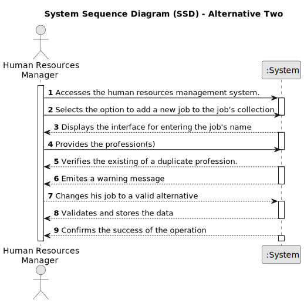

# US002 - Profession Registration

## 1. Requirements Engineering

### 1.1. User Story Description

As a Human Resources Manager I want to register a job.

### 1.2. Customer Specifications and Clarifications 

**From the specifications document:**

>	Each job is characterized by having a unique name. 

>	There can not be duplicated professions.

**From the client clarifications:**

> **Question:** What are the acceptance criteria? When creating a job that already exits, what does the system do?
>
> **Answer:** By definition a set can´t have duplicates. Assuring no duplicates is not a business rule is a tecnichal issue.

> **Question:** Which are the data for the creation of a profession?
>
> **Answer:** The name of it: Gardener, Driver, Cobbler, Electrician...

> **Question:** Is it relevant to associate a specific area or sector with each Job? (For example, "Gardener" would be inserted in the "Maintenance" sector).
>
> **Answer:** Is not necessary as there is no US to suggest that it might be necessary.

### 1.3. Acceptance Criteria

* **AC1:** If HRM does not have necessary permissions, the system should prompt a warning message.
* **AC2:** If HRM puts an invalid username or password, the system should prompt an error message.
* **AC3:** If the profession is already registered in the system, the system should notify the manager and suggest choosing another one.

### 1.4. Found out Dependencies

* No dependecies found.

### 1.5 Input and Output Data

**Input Data:**

* Typed data:
    * a job name
    
	
* Selected data:
    * a jobs category

**Output Data:**
* List of professions stored and added to the system
* (In)Success of the operation

### 1.6. System Sequence Diagram (SSD)

#### Alternative One

#### Alternative Two

### 1.7 Other Relevant Remarks

* Only new professions can be added, if an existing one is inserted by the manager the system issues a warning.
