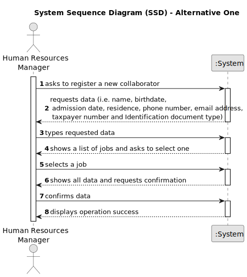

# US003 - Register a collaborator with a job and fundamental characteristics

## 1. Requirements Engineering

### 1.1. User Story Description

As a Human Resources Manager, I want to register a collaborator with a job and fundamental characteristics.

### 1.2. Customer Specifications and Clarifications 

**From the specifications document:**

>	Each task is characterized by having a unique reference per organization, a designation, an informal and a technical description, an estimated duration and cost, as well as a task category. 

>	As long as it is not published, access to the task is exclusive to the employees of the respective organization.

>   The human resources manager will fill all the required fields: name, birthdate, admission date, residence, phone number, email address, taxpayer number and Identification document type. Should also load an image of the identification document. Then he can select a job from a list to register a collaborator.

**From the client clarifications:**

> **Question:** When creating a collaborator with an existing name ... What the system do?
>
> **Answer:** It's not common and most improbable to have different individual with same name in the same context, however it’s ID documentation number should be unique for sure.

> **Question:** Which information is mandatory to insert a collaborator in the program (fundamental characteristics)?
>
> **Answer:** - name, birthdate, admission date, address, contact info (mobile and email), taxpayer number, ID doc type and respective number 
>             - displaying or not, It's a matter of UX, the dev team should decide about it, but the valid jobs are the ones created within the US02.

> **Question:** Should the system able the HRM to insert multiple collaborators in one interaction before saving them.
> 
> **Answer:** It's not required to do so.

> **Question:** Is there any limitation regarding the length of the name of the collaborator?
> 
> **Answer:** According to the Portuguese law a name should contain at maximum six words

> **Question:** Should we consider valid only the birthdate in which the collaborator has more than 18 years?
> 
> **Answer:** Yes

> **Question:** What should be the format for the phone number? 9 numbers?
> 
> **Answer:** validating 9 digits will be acceptable; validating with international format would be excellent.

> **Question:** What is the format for the numbers from the id doc types?
> 
> **Answer:** each doc type has specific formats like taxpayer number, Citizen Card ou passport.

> **Question:** What is needed for the address?  Street, zipcode and a city?
> 
> **Answer:** That would be enough.

> **Question:** What should be the accepted format for the emails? Should only specific email services be accepted?
> 
> **Answer:** A valid email address consists of an email prefix and an email domain, both in acceptable formats.
  The prefix appears to the left of the @ symbol. The domain appears to the right of the @ symbol.
  For example, in the address example@mail.com, "example" is the email prefix, and "mail.com" is the email domain.

### 1.3. Acceptance Criteria

* **AC1:** All required fields must be filled in.
* **AC2:** Name must be complete, should only have letters and have only at the maximum 9 words.
* **AC3:** Birthdate can only be chosen from the calendar given and can only register collaborators with 18 years old or more.
* **AC4:** Admission date can only be chosen from the calendar given.
* **AC5:** Residence must be written, this includes: door number, street, ZIP code, city, country. If there is anything more needed to be specified, should be written in the "More" box.
* **AC6:** Phone number can only have 9 numbers.
* **AC7:** Email address should have a prefix (before "@") and an email domain (after "@").
* **AC8:** Taxpayer number can only have 9 numbers.
* **AC9:** The user will select an identification document type from a list.
* **AC10:** An image of identification document should be loaded to the application.
* **AC11:** The user will select a job from a list of jobs provided by the application.

### 1.4. Found out Dependencies

* There is a dependency on "US002 - Profession Registration" as there must be at least one job to give a collaborator when registered.

### 1.5 Input and Output Data

**Input Data:**

* Typed data:
    * a name
    * the residence 
    * a phone number
    * an email
    * the taxpayer number
	
* Selected data:
    * a calendar for birthdate
    * a calendar for admission date
    * a list to select identification document type
    * a list to select a job

**Output Data:**

* List of existing task categories
* (In)Success of the operation

### 1.6. System Sequence Diagram (SSD)

**_Other alternatives might exist._**

#### Alternative One

### 1.7 Other Relevant Remarks

* The created task stays in a "not published" state in order to distinguish from "published" tasks.