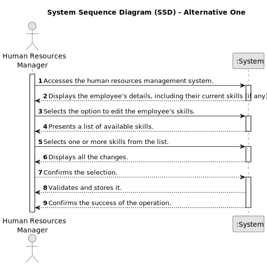
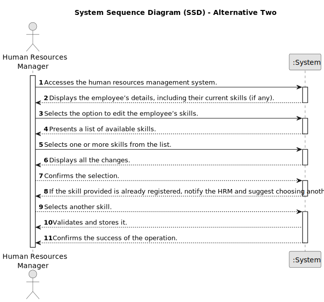

# US004 -  Assigning skills to a collaborator 

## 1. Requirements Engineering

### 1.1. User Story Description

As an HRM, I want to assign one or more skills to a collaborator.

### 1.2. Customer Specifications and Clarifications 

**From the specifications document:**

>	 An employee has 
a set of skills that enable him to perform/take on certain tasks/responsibilities.

**From the client clarifications:**

> **Question:** Is there a minimum and maximum number of skills?
>
> **Answer:** No.

> **Question:** Can any skill be registered to any collaborator/job? Or should they be associated in categories in association with a specific job
>
> **Answer:** There is no association, it totally depends of the CV of the collaborator.

> **Question:**  Is there any certification/proof needed to register a skill to a collaborator?
>
> **Answer:** No.

### 1.3. Acceptance Criteria

* **AC1:** The employee must be registered.
* **AC2:** The system should allow the HRM to select one or more skills from a predefined list.
* **AC3:** The system should provide a way to update or remove assigned skills as needed.

### 1.4. Found out Dependencies

* There is a dependency on "US001 - Registering Skills for Collaborators" as there must be at least one skill created.

### 1.5 Input and Output Data

**Input Data:**

* Typed data:
    * none.
	
* Selected data:
    * one or more skills.

**Output Data:**

* Display a message with all the information that will be changed.
* (In)Success of the operation

### 1.6. System Sequence Diagram (SSD)

**_Other alternatives might exist._**

#### Alternative One

#### Alternative Two

  ### 1.7 Other Relevant Remarks

* Ensure that the skill assignment process is user-friendly and intuitive.