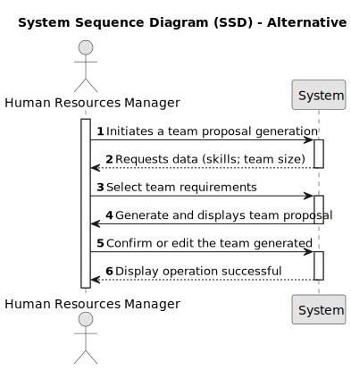

# US005 - Generate a team proposal automatically

## 1. Requirements Engineering

### 1.1. User Story Description

As a HRM, I want to generate a team proposal automatically

### 1.2. Customer Specifications and Clarifications 

**From the specifications document and client meetings:**

>   The team proposal generated his focus on facilitating and speeding up the process of creating a team. The Human Resources Manager (HRM) has the possibility of generating a team based on a set of previously selected skills and team size. Engage in the task of team building and come automate and recommend a team, having a great weight in managing and choosing the right team for a designated task.

>	The system provides a user interface to select various skills and team size. When HRM uses this generation, it will add all the skills you want the team to have for this task and the number of elements. Furthermore, HRM can view the list of selected information and confirm team generation based on this information.

**From forum:**

> **Question:** What is the information necessary for a team proposal?
>
> **Answer:** The customer provide the max size of the team and a set of skills

> **Question:** By having more team combinations for the same information. Should the system also generate them?
>
> **Answer:** .

> **Question:** Are the skills(input) typed or selected
> Does the output show the team members with or without their skills?
>
> **Answer:** the ux/ui is up to the dev team.

> **Question:** I would like to know which business rules apply for the input data to generate a team proposal.
>
> **Answer:** max and min team size, and a list of skills needed.
> For instance:
> 
> min: 3
> 
> max: 4

> **Question:** I would like to ask if, in this US, there should be any more information in the team generated beyond the collaborators in which it consists?
>
> **Answer:** The information should contain each of team members and the skills.

> **Question:** I would also like to know if a collaborator can be in more than one team at the same time?
>
> **Answer:** no

> **Question:** How does it generate the team if there are not enough employees?
>
> **Answer:** The system should provide information why it can't generate a team.

> **Question:** What should the output of the automation be? (should it just store the team proposal or show it to the customer?)  Will the team proposal be a document about all the instructions of each team member/worker?
>
> **Answer:** The systems provide team proposals and HRM can accept of refuse the proposals. In the future (not in this sprint) HRM may decide to edit the team.

> **Question:** If it doesn't have enough collaborators, or they don't have the requests skills. Should the system send a message?
>
> **Answer:** Yes, the system should provide information why it can't generate a team.
### 1.3. Acceptance Criteria

* **AC1:** Need to respect the min and max team size requested.
* **AC2:** Need to have as many collaborators as the number of the skills requested.
* **AC3:** Need to have at least one skill/collaborator registered to start a team generation.
* **AC4:** A collaborator can only be assigned to one team.
* **AC5:** The minimum size of a team is of two collaborators.

### 1.4. Found out Dependencies

* There is a dependency on "US001 - Registering Skills" as there must exist skills to assign to a collaborator.
* There is a dependency on "US003 - Register a collaborator" as there must be at least one collaborator to assign to a team.
* There is a dependency on "US004 - Assign Skills to a Collaborator" once there must be skills assigned to a collaborator so the system can search for them.

### 1.5 Input and Output Data

**Input Data:**
  * Typed data:
    * skills
    * min team size
    * max team size

**Output Data:**
  * team proposal/s
  * Error messages
  * Success of the operation

### 1.6. System Sequence Diagram (SSD)

**_Other alternatives might exist._**

### 1.7 Other Relevant Remarks

* None.
