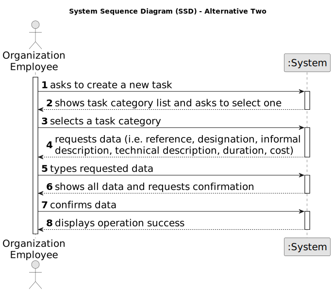

# US006 - Registering Vehicles

## 1. Requirements Engineering

### 1.1. User Story Description

As an FM, I wish to register a vehicle including Brand, Model, Type, Tare, Gross Weight, Current Km, Register Date, Acquisition Date, Maintenance/Checkup Frequency (in Kms).
### 1.2. Customer Specifications and Clarifications 

**From the specifications document:**

>	Register vehicles within the system to effectively manage the fleet utilized in maintaining green spaces. This registration process should capture crucial details including the brand, model, type, tare weight, gross weight, current kilometers, register date, acquisition date, and the maintenance/check-up frequency measured in kilometers.

> By having this functionality, fleet managers can ensure proper tracking, scheduling, and maintenance of vehicles, optimizing their utilization to support various tasks related to the management of green spaces.

**From the client clarifications:**

> **Question:** Should the application identify a registered vehicle by a serial number or other attribute?
>
> **Answer:** By plate id;

> **Question:** Should the application a group the vehicles by their brand, serial number or other attribute?
>
> **Answer:** No requirements were set concerning groups of vehicles;

> **Question:** If the FM inserts the same vehicle by mistake, should it inform their user of the mistake and give him the option to add another vehicle?
>
> **Answer:** Duplication of data is not a business rule is technical one, since by definition in a set you cant have duplicates;

> **Question:** For the application to work does the FM need to fill all the attributes of the vehicle?
>
> **Answer:** yes, besides the vehicle plate that by mistake doesn't appear on the text;

### 1.3. Acceptance Criteria

* **AC01:** When registering a vehicle the identity of this should be the number plate.
* **AC02:** There cannot be two cars with the same plate number.
* **AC03:** The system should ensure that only authorized FM Managers have permission to register vehicles.
* **AC04:** All required fields must be filled in (Brand, Model, Type...).
* **AC05:** The Maintenance/Checkup Frequency must be field in Kms.
* **AC06:** If the system encounters any errors during the skill registration process, it should provide informative error messages to the HR Manager, guiding them on how to resolve the issue.

### 1.4. Found out Dependencies

* There is a dependency on "US003 - Create a task category" as there must be at least one task category to classify the task being created.

### 1.5 Input and Output Data

**Input Data:**

* Typed data:
    * a reference
    * a designation 
    * an informal description
    * a technical description
    * an estimated duration
    * an estimated cost
	
* Selected data:
    * a task category 

**Output Data:**

* List of existing task categories
* (In)Success of the operation

### 1.6. System Sequence Diagram (SSD)

**_Other alternatives might exist._**

#### Alternative One

#### Alternative Two

### 1.7 Other Relevant Remarks

* The created task stays in a "not published" state in order to distinguish from "published" tasks.