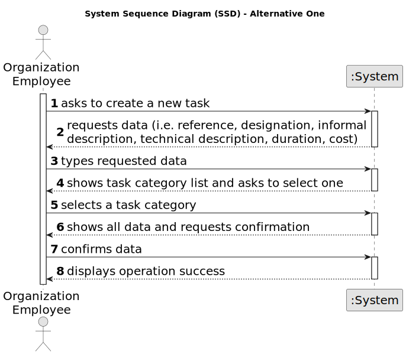

# US007 - Register the overhaul of a vehicle

## 1. Requirements Engineering

### 1.1. User Story Description

As an FM, I wish to register a vehicle’s check-up

### 1.2. Customer Specifications and Clarifications 

**From the specifications document:**

>None. 

**From the client clarifications:**

> **Question:** What information is needed when registering a vehicle after check up?
>
> **Answer:** Plate number, data and current mileage.

> **Question:** What is the unit of measurement used to estimate the check-up frequency (Kms, months, etc.)?
>
> **Answer:** In real context all could be considered, in the scope of this project just kms will be considered.

### 1.3. Acceptance Criteria

* **AC01:** All required fields must be filled in (Plate number, Data and Current Mileage).
* **AC02:** The vehicle must be registered.
* **AC03:** The system should consider kilometers as the unit of measurement for estimating the next check-up.
* **AC04:** The system should ensure that only authorized FM Managers have permission to register a vehicle's check-up.
* **AC05:** If the system encounters any errors during the check-up registration process, it should provide informative error messages to the HR Manager, guiding them on how to resolve the issue.

### 1.4. Found out Dependencies

* There is a dependency on "US006 - Registering Vehicles" as there must be at least one vehicle created.

### 1.5 Input and Output Data

**Input Data:**

* Typed data:
    * a reference
    * a designation 
    * an informal description
    * a technical description
    * an estimated duration
    * an estimated cost
	
* Selected data:
    * a task category 

**Output Data:**

* List of existing task categories
* (In)Success of the operation

### 1.6. System Sequence Diagram (SSD)

**_Other alternatives might exist._**

#### Alternative One

#### Alternative Two

### 1.7 Other Relevant Remarks

* The created task stays in a "not published" state in order to distinguish from "published" tasks.