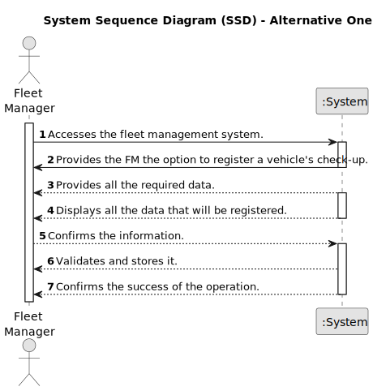
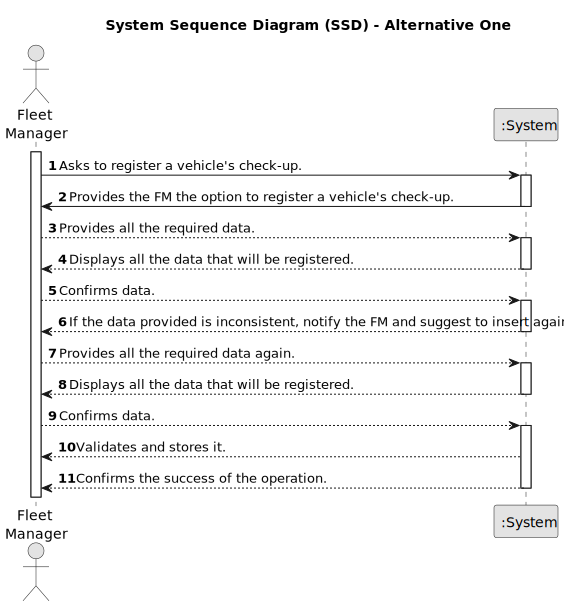

# US007 - Register the overhaul of a vehicle

## 1. Requirements Engineering

### 1.1. User Story Description

As an FM, I wish to register a vehicle’s check-up

### 1.2. Customer Specifications and Clarifications 

**From the specifications document:**

>None. 

**From the client clarifications:**

> **Question:** What information is needed when registering a vehicle after check up?
>
> **Answer:** Licence, date and current mileage.

> **Question:** What is the unit of measurement used to estimate the check-up frequency (Kms, months, etc.)?
>
> **Answer:** In real context all could be considered, in the scope of this project just kms will be considered.

> **Question:** can a vehicle not have a check-up?
>
> **Answer:** Yes.

> **Question:** Does a vehicle need to be registered in US06 before being able to go for a check-up in US07?
>
> **Answer:** Yes.

> **Question:** After registering a vehicle, should the vehicle info appear or only the (in)success of the operation?
>
> **Answer:** The UX/UI is up to dev team.

> **Question:** What are the validation requirements for the vehicle ID?
>
> **Answer:** After 2020: AA-00-AA
              between 2005-2020 00-AA-00
              between 1992-2005 00-00-XX

> **Question:** Can a vehicle have more than one check-up?
>
> **Answer:** Yes.

### 1.3. Acceptance Criteria

* **AC01:** All required fields must be filled in (Licence plate, Data and Current Mileage).
* **AC02:** The vehicle must be registered.
* **AC03:** The system should consider kilometers as the unit of measurement for estimating the next check-up.
* **AC04:** The system should ensure that only authorized FM Managers have permission to register a vehicle's check-up.
* **AC05:** If the system encounters any errors during the check-up registration process, it should provide informative error messages to the HR Manager, guiding them on how to resolve the issue.

### 1.4. Found out Dependencies

* There is a dependency on "US006 - Registering Vehicles" as there must be at least one vehicle created.

### 1.5 Input and Output Data

**Input Data:**

* Typed data:
    * a date
    * a license plate
    * a mileage
	
* Selected data:
    * a vehicle

**Output Data:**

* Display a message with all the information that will be registered.
* (In)Success of the operation

### 1.6. System Sequence Diagram (SSD)

**_Other alternatives might exist._**

#### Alternative One

#### Alternative Two

### 1.7 Other Relevant Remarks

* None.