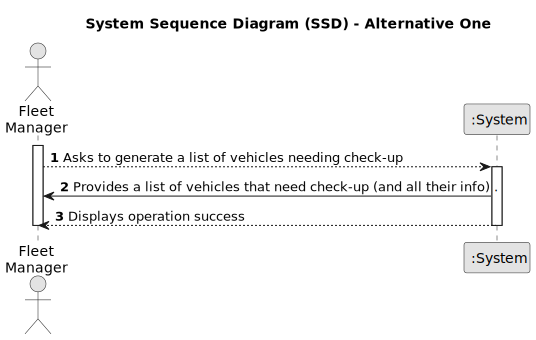

# US008 - Overhauling of vehicles

## 1. Requirements Engineering

### 1.1. User Story Description

As a Fleet Manager I intend to list the vehicles that need overhauling.

### 1.2. Customer Specifications and Clarifications 

**From the specifications document:**

>	The system should prompt all the vehicles that need overhauling and the user must choose the one(s) he wants to select. 

>	It is possible that no vehicles need overhauling.

**From the client clarifications:**

> **Question:** O sistema deve indicar automaticamente os veículos que necessitam de revisão?
>
> **Answer:** 

> **Question:** O user deve escoher que veículos que quer para revisão?
>
> **Answer:** 

> **Question:** Qual é o critério para que o veículo fique elegível para revisão?

### 1.3. Acceptance Criteria

* **AC1:** If FM does not have the necessary permissions, the system should prompt a warning message.
* **AC2:** If there are no vehicles that need overhauling, the system notifies the FM.

### 1.4. Found out Dependencies

* There is a dependency on "US006 - Machinery registration" as there must be at least one vehicle in the system so that it can check the need for overhauling.

### 1.5 Input and Output Data

**Input Data:**

* Typed data:
    * selection of the option to see wich vehicles need overhauling
	
* Selected data:
    * vehicles category 

**Output Data:**

* List of vehicles that need overhauling
* (In)Success of the operation

### 1.6. System Sequence Diagram (SSD)

#### Alternative One

### 1.7 Other Relevant Remarks

* The selected vehicles stay in a "chosen" state in order to distinguish from "non chosen" ones.