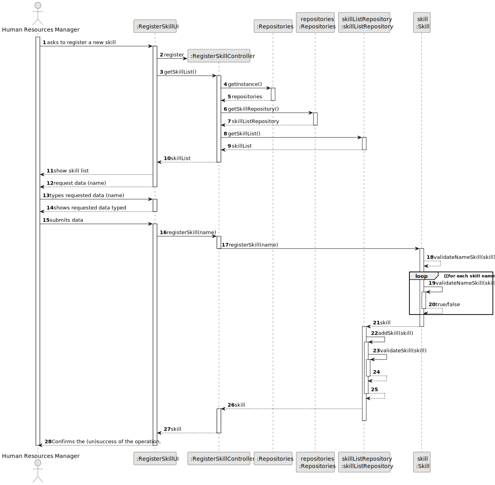
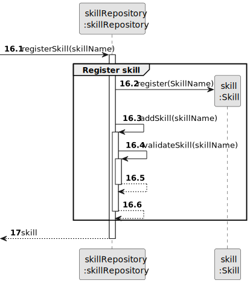

# US001 - Registering Skills

## 3. Design - User Story Realization 

### 3.1. Rationale

_**Note that SSD - Alternative One is adopted.**_

| Interaction ID                                       | Question: Which class is responsible for...           | Answer                  | Justification (with patterns)                                                                                 |
|:-----------------------------------------------------|:------------------------------------------------------|:------------------------|:--------------------------------------------------------------------------------------------------------------|
| Step 1 : ask to register a skill   	                 | 	... interacting with the actor?                      | RegisterSkillUI         | Pure Fabrication: there is no reason to assign this responsibility to any existing class in the Domain Model. |
| 			  		                                              | 	... coordinating the US?                             | RegisterSkillController | Controller                                                                                                    |
| Step 2 : request data (skillName)		                  | 	... displaying the form for the actor to input data? | RegisterSkillUI         | Pure Fabrication                                                                                              |
| Step 3 : types requested data (skillName)		          | 	... temporarily keeping the input data?              | RegisterSkillUI                   | Pure Fabrication.                                                                                             |
| Step 4 : show all data registered for confirmation		 | 	... display all the information before submitting?   | RegisterSkillUI         | Pure Fabrication.                                                                                             |
| Step 5 : submits data		                               | 	... creating the skill object?						                 | SkillRepository         | Creator (Rule 1): in the DM SkillRepository has a Skill.                                                      |              
| 			  		                                               | 	... validating all data (global validation)?         | SkillRepository         | IE: knows all its skills.                                                                                     |
| 	                                                     | 	... validating all data (local validation)?          | Skill                   | IE: kowns its data.                                                                                           | 
| 			  		                                               | 	... saving the register skill?                       | SkillRepository         | IE: owns all its skills.                                                                                      |
| Step 6 : shows operation success		                    | 	... informing operation success?                     | RegisterSkillUI         | IE: is responsible for user interactions.                                                                     | 

### Systematization ##

According to the taken rationale, the conceptual classes promoted to software classes are: 

* SkillRepository
* Skill

Other software classes (i.e. Pure Fabrication) identified: 

* RegisterSkillUI  
* RegisterSkillController

## 3.2. Sequence Diagram (SD)

_**Note that SSD - Alternative Two is adopted.**_

### Full Diagram

This diagram shows the full sequence of interactions between the classes involved in the realization of this user story.

### Split Diagrams

The following diagram shows the same sequence of interactions between the classes involved in the realization of this user story, but it is split in partial diagrams to better illustrate the interactions between the classes.

It uses Interaction Occurrence (a.k.a. Interaction Use).

[//]: # (**Get Skill List Partial SD**)

[//]: # (![Sequence Diagram - Partial - Get Task Category List]&#40;svg/us001-sequence-diagram-partial-get-skill-list.svg&#41;)

[//]: # (**Get Task Category Object**)

[//]: # ()
[//]: # (![Sequence Diagram - Partial - Get Task Category Object]&#40;svg/us001-sequence-diagram-partial-get-task-category.svg&#41;)

[//]: # (**Get Employee**)

[//]: # ()
[//]: # (![Sequence Diagram - Partial - Get Employee]&#40;svg/us001-sequence-diagram-partial-get-employee.svg&#41;)

**Register Skill**

## 3.3. Class Diagram (CD)

