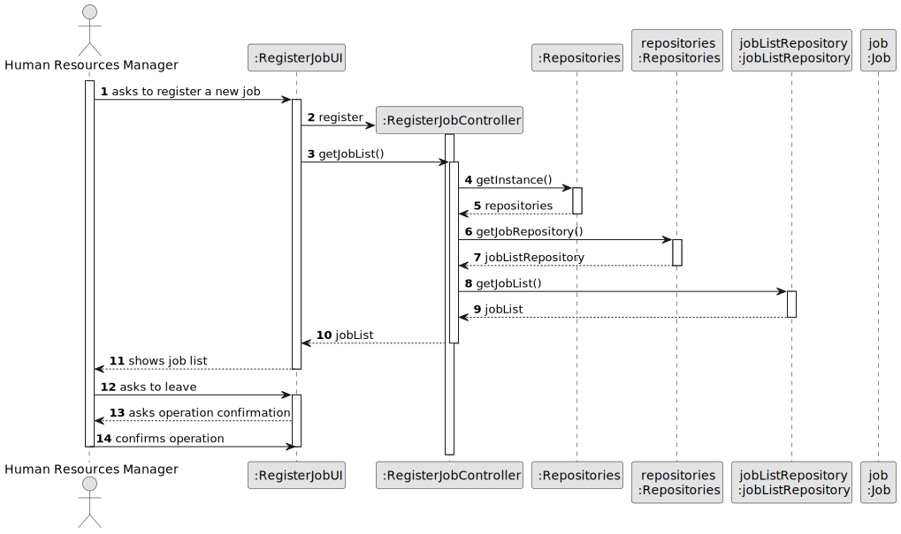
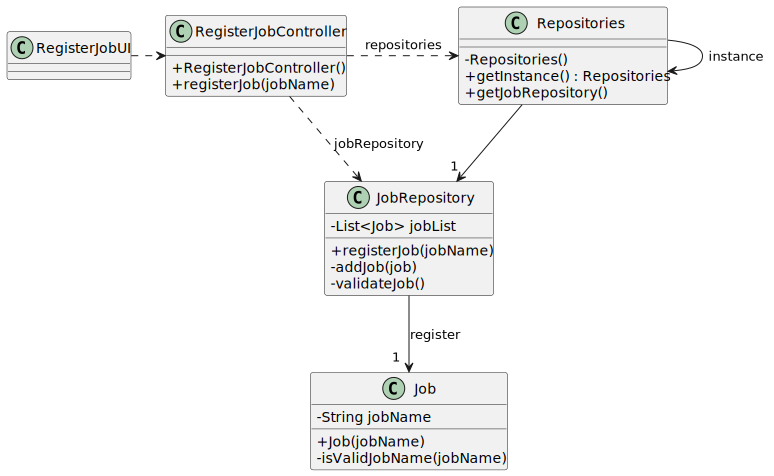

# US002 - Job Registration

## 3. Design - User Story Realization 

### 3.1. Rationale

| Interaction ID | Question: Which class is responsible for... | Answer                | Justification (with patterns)                                                                                  |
|:---------------|:------------------------------------------ |:----------------------|:---------------------------------------------------------------------------------------------------------------|
| Step 1         | ... interacting with the actor?           | RegisterJobUI         | Pure Fabrication: there is no reason to assign this responsibility to any existing class in the Domain Model.  |
|                | ... coordinating the use case?           | RegisterJobController | Controller                                                                                                     |
|                | ... instantiating a new Job?              | Job                   | Creator (Rule 1): in the DM, Job is a distinct entity with its own attributes.                                  |
| Step 2         | ... saving the inputted data?             | Job                   | IE: object created in step 1 has its own data.                                                                 |
| Step 3         | ... saving the created job?               | JobListRepository     | IE: responsible for persisting job data.                                                                       |
| Step 4         | ... validating all data (local validation)? | JobListRepository     | IE: owns its data.                                                                                             | 
| Step 5         | ... informing operation success?          | RegisterJobUI         | IE: is responsible for user interactions.                                                                      | 

### Systematization

Based on the provided sequence diagram, the conceptual classes promoted to software classes are:

- **Job**
- **JobListRepository**

Other software classes identified (i.e., Pure Fabrication):

- **RegisterJobUI**
- **RegisterJobController**

## 3.2. Sequence Diagram (SD)

### Full Diagram

This diagram shows the full sequence of interactions between the classes involved in the realization of this user story.

_**Version 1**_

_**Version 2**_

## 3.3. Class Diagram (CD)

