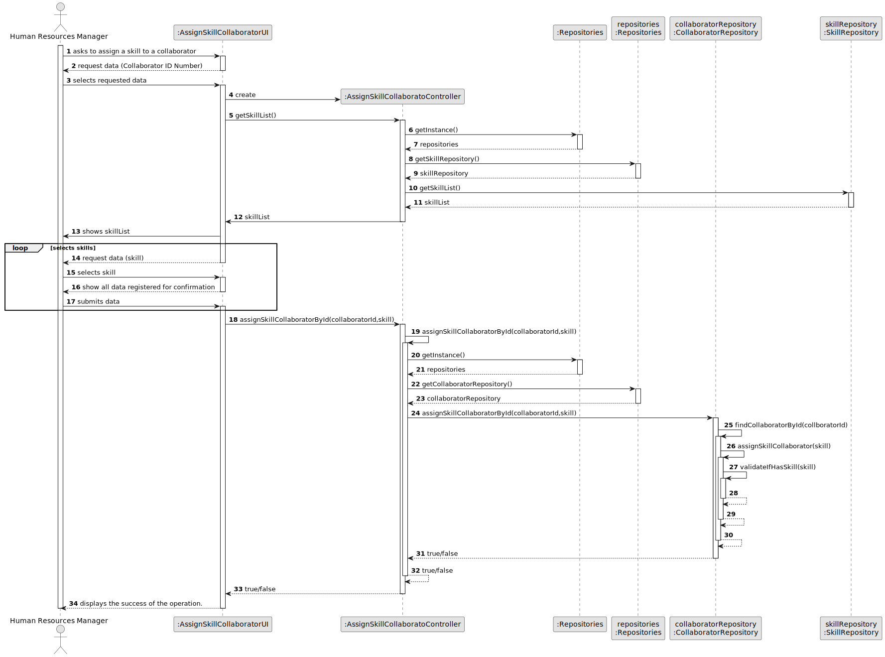
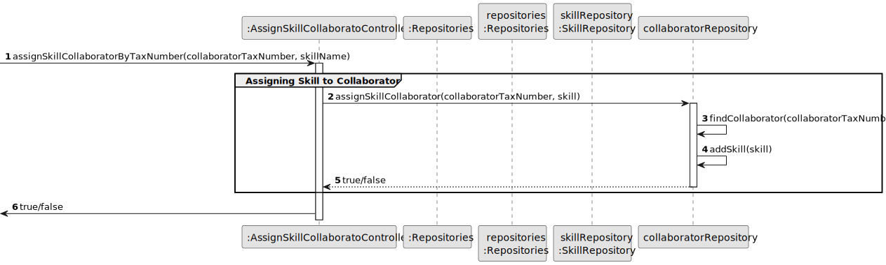
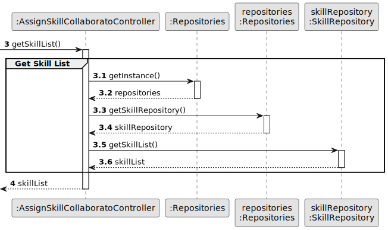
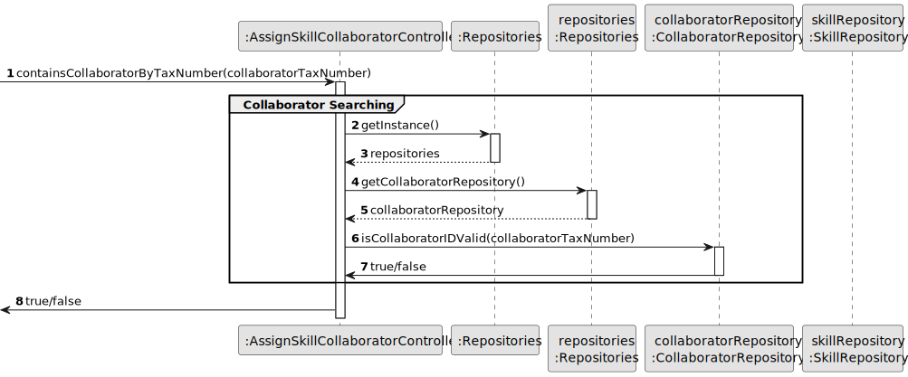
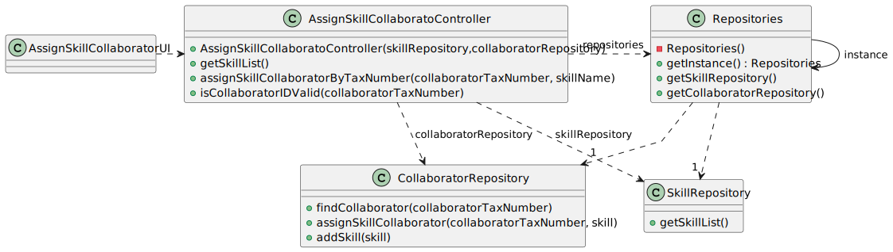

# US004 - Assigning skills to a collaborator

## 3. Design - User Story Realization

### 3.1. Rationale

_**Note that SSD - Alternative One is adopted.**_

| Interaction ID                                          | Question: Which class is responsible for...           | Answer                            | Justification (with patterns)                                                                                 |
|:--------------------------------------------------------|:------------------------------------------------------|:----------------------------------|:--------------------------------------------------------------------------------------------------------------|
| Step 1 : ask to assign a skill to a collaborator 	      | 	... interacting with the actor?                      | AssignSkillCollaboratorUI         | Pure Fabrication: there is no reason to assign this responsibility to any existing class in the Domain Model. |
| Step 2 : request data (collaboratorTaxNumber)		         | 	... displaying the form for the actor to input data? | AssignSkillCollaboratorUI         | Pure Fabrication                                                                                              |
| Step 3 : types requested data (collaboratorTaxNumber)		 | 	... temporarily keeping the input data?              | AssignSkillCollaboratorUI         | Pure Fabrication.                                                                                             |
| 			  		                                                 | 	... coordinating the US?                             | AssignSkillCollaboratorController | Controller                                                                                                    |
| Step 4: show all available skills		  		                 | 	...display all the information?                      | AssignSkillCollaboratorUI         | Pure Fabrication.                                                                                                    |
| Step 2 : request data (skillName)		                     | 	... displaying the form for the actor to input data? | AssignSkillCollaboratorUI         | Pure Fabrication                                                                                              |
| Step 3 : types requested data (skillName)		             | 	... temporarily keeping the input data?              | AssignSkillCollaboratorUI         | Pure Fabrication.                                                                                             |
| Step 4 : show all data registered for confirmation		    | 	... display all the information before submitting?   | AssignSkillCollaboratorUI         | Pure Fabrication.                                                                                             |
| Step 5 : submits data		                                 | 	... assigning a skill to a collaborator?						       | CollaboratorRepository            | Creator (Rule 1): in the DM SkillRepository has a Skill.                                                      |              
| 			  		                                                 | 	... validating all data (global validation)?         | SkillRepository                   | IE: knows all its skills.                                                                                     |
| 	                                                       | 	... validating all data (local validation)?          | Skill                             | IE: kowns its data.                                                                                           | 
| 			  		                                                 | 	... saving the register skill?                       | SkillRepository                   | IE: owns all its skills.                                                                                      |
| Step 6 : shows operation success		                      | 	... informing operation success?                     | AssignSkillCollaboratorUI         | IE: is responsible for user interactions.                                                                     | 

### Systematization ##

According to the taken rationale, the conceptual classes promoted to software classes are:

* SkillRepository
* CollaboratorRepository
* Skill

Other software classes (i.e. Pure Fabrication) identified:

* AssignSkillCollaboratorUI
* AssignSkillCollaboratorController

## 3.2. Sequence Diagram (SD)

### Full Diagram

This diagram shows the full sequence of interactions between the classes involved in the realization of this user story.

### Split Diagrams

The following diagram shows the same sequence of interactions between the classes involved in the realization of this user story, but it is split in partial diagrams to better illustrate the interactions between the classes.

It uses Interaction Occurrence (a.k.a. Interaction Use).

**Assigning Skill to Collaborator**

**Get Skill List**

**Collaborator Searching**

## 3.3. Class Diagram (CD)

