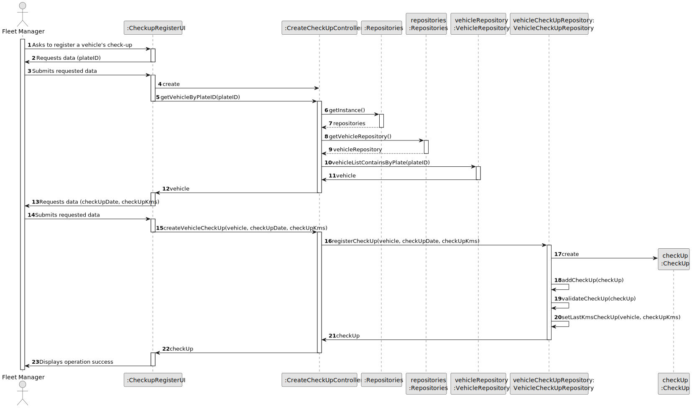
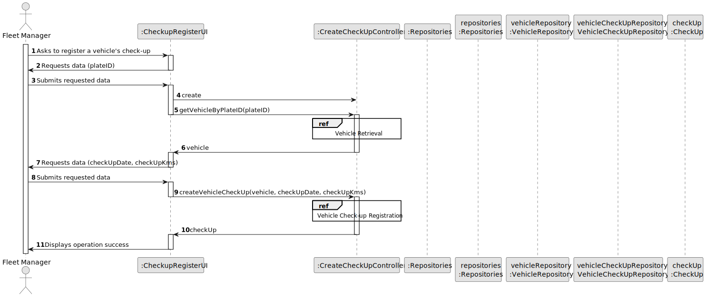
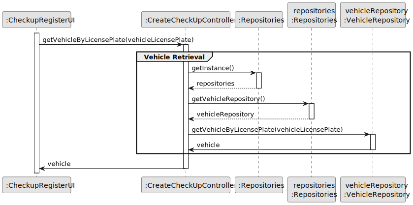
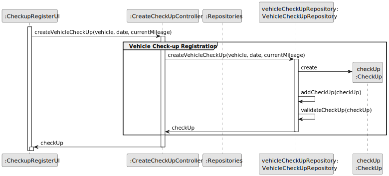

# US007 - Register the check-up of a vehicle

## 3. Design - User Story Realization

### 3.1. Rationale

| Interaction ID                                       | Question: Which class is responsible for...           | Answer                   | Justification (with patterns)                                                                                 |
|:-----------------------------------------------------|:------------------------------------------------------|:-------------------------|:--------------------------------------------------------------------------------------------------------------|
| Step 1 : ask to register a vehicle´s check-up   	    | 	... interacting with the actor?                      | CheckupRegisterUI        | Pure Fabrication: there is no reason to assign this responsibility to any existing class in the Domain Model. |
| Step 2 : request data (plateID)		                    | 	... displaying the form for the actor to input data? | CheckupRegisterUI        | Pure Fabrication                                                                                              |
| Step 3 : types requested data (plateID)		            | 	... temporarily keeping the input data?              | CheckupRegisterUI        | Pure Fabrication.                                                                                             |
| 			  		                                              | 	... coordinating the US?                             | CreateCheckUpController  | Controller                                                                                                    |
| Step 4 : request data (CheckUpDate, checkUpKms)		    | 	... displaying the form for the actor to input data? | CheckupRegisterUI        | Pure Fabrication                                                                                              |
| Step 5 : types requested data (CheckUpDate, checkUpKms)		            | 	... temporarily keeping the input data?              | CheckupRegisterUI        | Pure Fabrication.                                                                                             |
| Step 6 : show all data registered for confirmation		 | 	... display all the information before submitting?   | CheckupRegisterUI        | Pure Fabrication.                                                                                             |
| Step 7 : submits data		                              | 	... creating the vehicle´s check-up?						           | VehicleCheckUpRepository | Creator (Rule 1): in the DM VehicleCheckUpRepository has a Check-Up.                                          |              
| 			  		                                              | 	... validating all data (global validation)?         | VehicleCheckUpRepository | IE: knows all its check-ups.                                                                                  |
| 	                                                    | 	... validating all data (local validation)?          | Check-Up                 | IE: kowns its data.                                                                                           | 
| 			  		                                              | 	... saving the vehicle´s check-up?                       | VehicleCheckUpRepository | IE: owns all its check-ups.                                                                                   |
| Step 8 : shows operation success		                   | 	... informing operation success?                     | CheckupRegisterUI        | IE: is responsible for user interactions.                                                                     | 

### Systematization ##

According to the taken rationale, the conceptual classes promoted to software classes are:

* Check-Up

Other software classes (i.e. Pure Fabrication) identified:

* CreateCheckUpController
* CheckupRegisterUI
* VehicleCheckUpRepository

## 3.2. Sequence Diagram (SD)

### Full Diagram

This diagram shows the full sequence of interactions between the classes involved in the realization of this user story.

### Split Diagrams

The following diagram shows the same sequence of interactions between the classes involved in the realization of this
user story, but it is split in partial diagrams to better illustrate the interactions between the classes.

It uses Interaction Occurrence (a.k.a. Interaction Use).

**Vehicle Check-up Registration**

**Vehicle Retrieval**

## 3.3. Class Diagram (CD)

