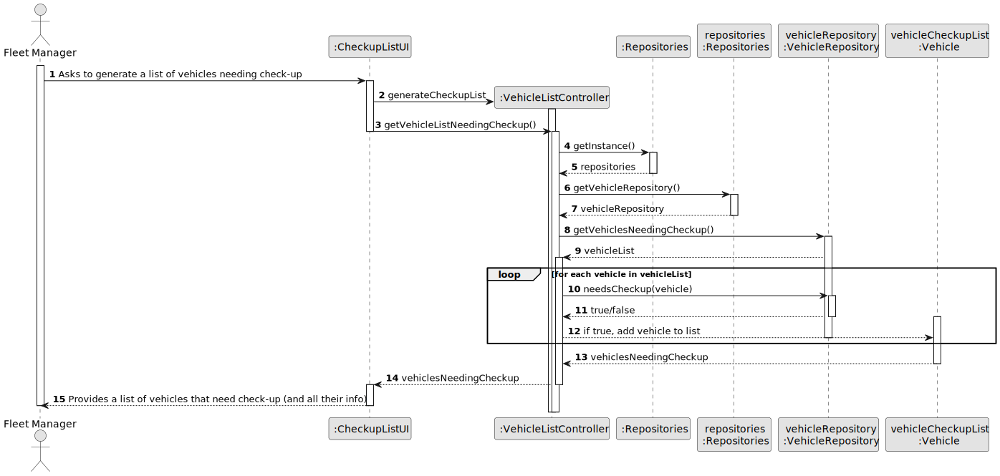
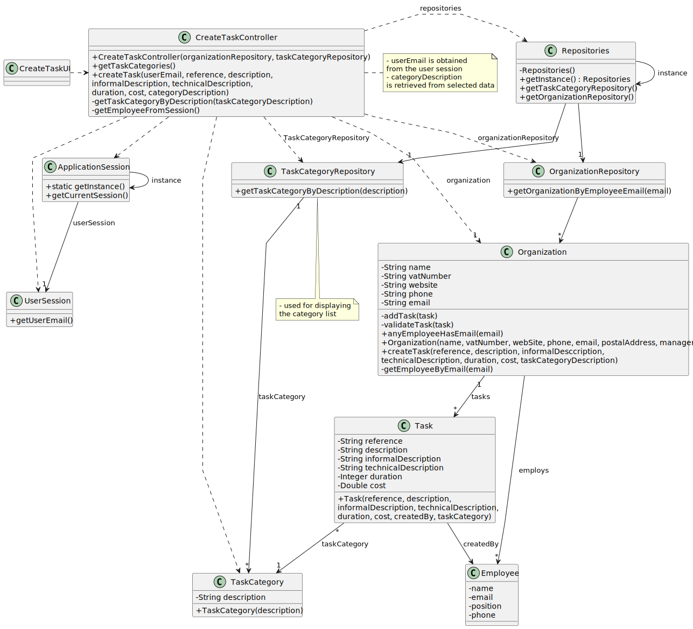

# US008 - Overhauling of vehicles 

## 3. Design - User Story Realization 

### 3.1. Rationale

| Interaction ID | Question: Which class is responsible for... | Answer               | Justification (with patterns)                                                                                             |
|:---------------|:------------------------------------------- |:---------------------|:--------------------------------------------------------------------------------------------------------------------------|
| Step 1         | ... interacting with the actor?            | CheckupListUI        | Pure Fabrication: there is no reason to assign this responsibility to any existing class in the Domain Model.             |
|                | ... coordinating the use case?             | VehicleListController | Controller                                                                                                                |
|                | ... querying the repository for vehicles needing check-up? | VehicleRepository | Repository: VehicleRepository interacts with the storage system to retrieve data about vehicles needing check-up.         |
|                | ... filtering the vehicles needing check-up? | VehicleRepository | Controller: VehicleRepository coordinates the logic for determining which vehicles need check-up based on business rules. |
|                | ... adding vehicles needing check-up to a list? | VehicleListController | Creator: Vehicle represents the entity being added to the list.                                                  |
| Step 2         | ... informing the user about the vehicles needing check-up? | CheckupListUI | Controller: CheckupListUI is responsible for presenting information to the user based on the result of the use case.      |

### Systematization

Based on the provided sequence diagram, the conceptual classes promoted to software classes are:

- **Vehicle**
- **VehicleRepository**

Other software classes identified (i.e., Pure Fabrication):

- **CheckupListUI**
- **VehicleListController**

## 3.2. Sequence Diagram (SD)

### Full Diagram

This diagram shows the full sequence of interactions between the classes involved in the realization of this user story.

## 3.3. Class Diagram (CD)

