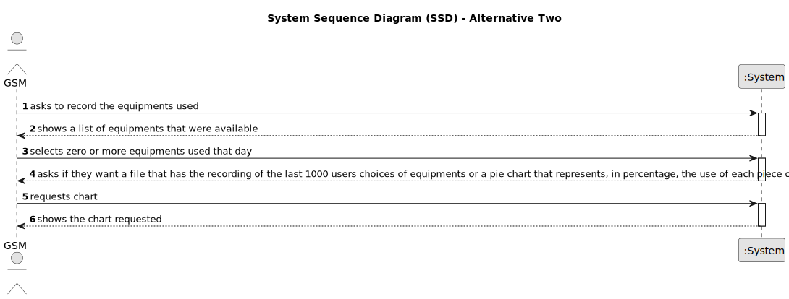

# US010 - Equipment Preferences

## 1. Requirements Engineering

### 1.1. User Story Description

As a GSM, I want to know which piece(s) of equipment is/are used in each day so that I can understand the users’ preferences. Consider that the park has the following equipment: walking paths, children’s playground, picnic area, and exercise machines (gymnastics equipment). At the park exit there is an electronic device with a list of all used that day.

### 1.2. Customer Specifications and Clarifications 

**From the specifications document and client meetings:**

**From forum:**

### 1.3. Acceptance Criteria 

* **AC1:** The user will select zero or more options from a list.

### 1.4. Found out Dependencies

* N/A

### 1.5 Input and Output Data

**Input Data:**

* Selected data:
    * Equipment that was used by the user

**Output Data:**

* File named "EquipmentUsed.csv" that records the equipment used by 1000 users
* A pie chart representing, in percentage, the use of each piece of equipment
* (In)Success of the operation

### 1.6. System Sequence Diagram (SSD)

#### Alternative One

