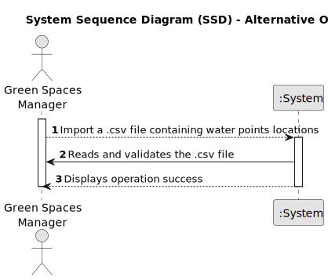

# US012 - Importing Water Point Routes and Installation Costs

## 1. Requirements Engineering

### 1.1. User Story Description

As a GSM, I want to import a .csv file containing lines with:
(Water Point X, Water Point Y, Distance) into a unique data structure.

### 1.2. Customer Specifications and Clarifications 

**From the specifications document and client meetings:**

>	The set of imported lines describes all possible routes that can be
opened to lay pipes between each pair of water points, and their respective installation costs 
 (these could simply refer to the length, or to any other cost parameter).

**From forum:**

> **Question:** 
>
> **Answer:**  

> **Question:** 
>
> **Answer:**

> **Question:** 
>
> **Answer:** 

> **Question:** 
>
> **Answer:** 

### 1.3. Acceptance Criteria 

* **AC1:** 
* **AC2:** 
* **AC2:** 

### 1.4. Found out Dependencies

* 

### 1.5 Input and Output Data

**Input Data:**

* 

**Output Data:**

* 
* 

### 1.6. System Sequence Diagram (SSD)

#### Alternative One

