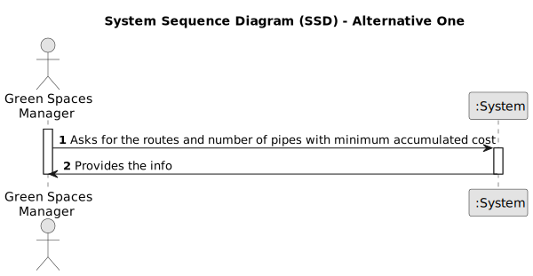

# US013 - Optimizing irrigation

## 1. Requirements Engineering

### 1.1. User Story Description

As a Green Spaces Manager I intend to now the routes to be opened and the pipes needed to be laid with a minimum accumulated cost, ensuring that all points are adequately supplied.

### 1.2. Customer Specifications and Clarifications 

**From the specifications document and client meetings:**

>   Only primitive operations must be used during the making of the algorithm

>	Text output format with ordered pair is acceptable to represent the routes

>   ?

**From forum:**

> **Question:** .
>
> **Answer:**  .

> **Question:** .
>
> **Answer:** .

> **Question:** .
>
> **Answer:** .

> **Question:** .
>
> **Answer:** .

### 1.3. Acceptance Criteria 

* **AC1:**  All implemented procedures must only use primitive operations, and not existing functions in JAVA libraries.
* **AC2:** .
* **AC2:** .

### 1.4. Found out Dependencies

* There is a dependency on "US012 - Importing Water Point Routes and Installation Costs" as there must be enough info in the system (collected in US012) for the algorithm to work.

### 1.5 Input and Output Data

**Input Data:**

* The system automatically retrieves the routes to be opened and the pipes needed to be laid with a minimum accumulated cost, without requiring any manual input.

**Output Data:**

* routes
* minimum cost
* (In)Success of the operation

### 1.6. System Sequence Diagram (SSD)

#### Alternative One

