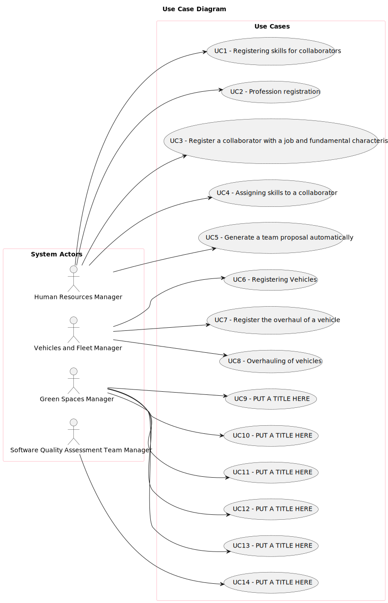

# Use Case Diagram (UCD)

# Use Cases / User Stories

| UC/US           | Description                                                                                               |                   
|:----------------|:----------------------------------------------------------------------------------------------------------|
| US001           | [Registering Skills](../../us001/Readme.md)                                                               |
| US002           | [Profession Registration](../../us002/Readme.md)                                                          |
| US003           | [Register a collaborator with a job and fundamental characteristics](../../us003/Readme.md)               |
| US004           | [Assigning skills to a collaborator](../../us004/Readme.md)                                               |
| US005           | [Generate a team proposal automatically](../../us005/Readme.md)                                           |
| US006           | [Registering Vehicles](../../us006/Readme.md)                                                             |
| US007           | [Register the check-up of a vehicle](../../us007/Readme.md)                                               |
| US008           | [Check-up of vehicles](../../us008/Readme.md)                                                             |
| US009           | [Water consumption of green spaces](../../../../MATCP/us009/Readme.md)                                          |
| US010           | [Equipment Preferences](../../../../MATCP/us010/Readme.md)                                                      |
| US011           | [Collect data from the user portal about the use of the park](../../../../MATCP/us011/Readme.md)                |
| US012           | [Importing Water Point Routes and Installation Costs](../../MDISC/us012/Readme.md)                        |
| US013           | [Optimizing irrigation](../../MDISC/us013/Readme.md)                                                      |
| US014           | [Running Asymptotic Behavior Tests](../../MDISC/us014/Readme.md)                                          |
| US015           |                                                                                                       |
| US016           |                                                                                                       |
| US017           |                                                                                                       |
| US018           |                                                                                                       |
| US019           |                                                                                                       |
| US020           | [Register a Green Space](../../us020/Readme.md)                                                           |
| US021           | [Adding a To-Do List Entry for Green Space Management](../../us021/Readme.md)                             |
| US022           | [Add a new entry in the Agenda](../../us022/Readme.md)                                                    |
| US023           | [Assign a Team to an entry in the Agenda](../../us023/Readme.md)                                          |
| US024           | [A Postpone task in Agenda](../../us024/Readme.md)                                                        |
| US025           | [Cancel entry in Agenda](../../us025/Readme.md)                                                           |
| US026           | [ Assign One or More Vehicles to Agenda Entry](../../us026/Readme.md)                                     |
| US027           | [Show an organized list of all green spaces managed by manager](../../us027/Readme.md)                    |
| US028 and US029 | [ consult the tasks assigned to me and record the completion of a task.](../../us028 and us029/Readme.md) |
