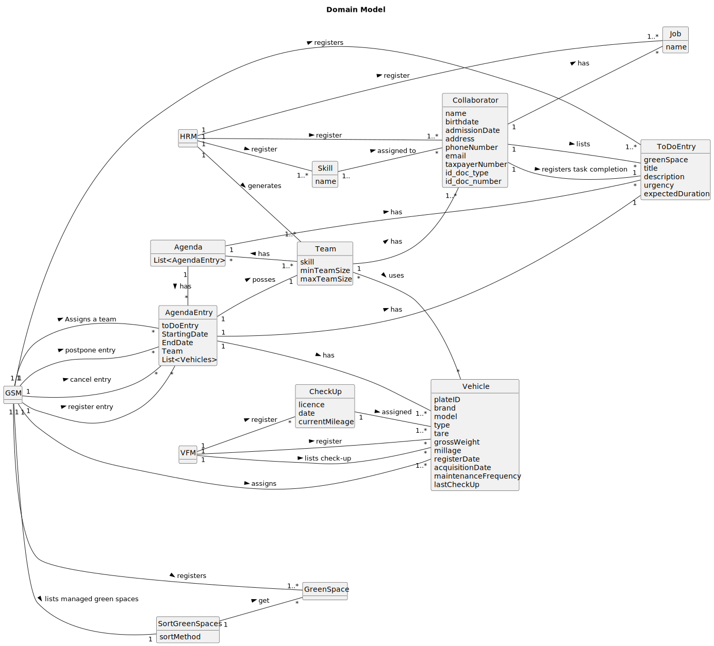

**# OO Analysis

## Rationale to identify domain conceptual classes

### _Conceptual Class Category List_

**Business Transactions**

* Vehicle Maintenance
* Team Assignment

---

**Transaction Line Items**

*

---

**Product/Service related to a Transaction or Transaction Line Item**

*

---

**Transaction Records**

*

---  

**Roles of People or Organizations**

* GSM manages multiple GreenSpace.

* GSU uses multiple GreenSpace.

* VFM registers multiple Vehicle.
* VFM selects multiple VehicleForCheckUp.
* VFM registers multiple CheckUp.

* HRM registers multiple Skill.
* HRM registers multiple Job.
* HRM registers multiple Collaborator.
* HRM generates multiple Team.

* Collaborator has one Job

---

**Places**

* GreenSpace contains Garden.
* GreenSpace contains Medium-sized park.
* GreenSpace contains Large-sized park.

---

**Noteworthy Events**

* MusgoSublime manages green spaces, which are used by GSU and managed by GSM. This system has collaborators who have a
  job and skills assigned to them which are registered by HRM.
  HRM also generates teams composed by collaborators. These teams have an agenda to follow defined by tasks. They also
  use vehicles (registered by VFM) who can transport equipment and machines.
  These vehicles need a periodical check-up (defined by VFM), the system informs the VFM of what vehicles need check-up,
  he may select the ones he wants and registers the overhauling.

---

**Physical Objects**

* Vehicle transports Equipment
* Vehicle transports Machine
* Vehicle is registered by VFM

---

**Descriptions of Things**

* Agenda defines multiple Task
* Skill is assigned to multiple Collaborator
* Task requires multiple Skill
* Task requires multiple Job

---

**Catalogs**

*

---

**Containers**

* Team
* VehicleForCheckUp
* Collaborator

---

**Elements of Containers**

* Team contains Collaborator
* VehicleForCheckUp contains (some)Vehicle
* Collaborator contains (some)Job and Skill

---

**Organizations**

* MusgoSublime :  is an organization dedicated to the planning, construction and maintenance of green spaces for
  collective use in their multiple dimensions.
* MusgoSublime manages multiple GreenSpace

---

**Other External/Collaborating Systems**

* No info

---

**Records of finance, work, contracts, legal matters**

* No info

---

**Financial Instruments**

* No info

---

**Documents mentioned/used to perform some work/**

* Integrative Project Assignment (EN) - Versions 1 to 1.2 (to be updated)

---

## Rationale to identify associations between conceptual classes

| Concept (A)     |          Association          |     Concept (B) |
|-----------------|:-----------------------------:|----------------:|
| GreenSpace      |       is registered by        |             GSM |
| ToDoEntry       |       is registered by        |             GSM |
| AgendaEntry     |       is registered by        |             GSM |
| AgendaEntry     |     is assigned a team by     |             GSM |
| AgendaEntry     |        is postponed by        |             GSM |
| AgendaEntry     |        is canceled by         |             GSM |
| Vehicle         |        is assigned by         |             GSM |
| SortGreenSpaces |  lists managed green spaces   |             GSM |
| GreenSpace      |        is retrieved by        | SortGreenSpaces |
| Vehicle         |          is used by           |     AgendaEntry |
| Team            |        is possessed by        |     AgendaEntry |
| AgendaEntry     |        is contained in        |          Agenda |
| ToDoEntry       |        is contained in        |     AgendaEntry |
| CheckUp         |       is registered by        |             VFM |
| Vehicle         |       is registered by        |             VFM |
| CheckUp         |           lists for           |             VFM |
| Vehicle         |        is assigned to         |         CheckUp |
| Skill           |       is registered by        |             HRM |
| Job             |       is registered by        |             HRM |
| Collaborator    |       is registered by        |             HRM |
| Team            |        is generated by        |             HRM |
| Collaborator    |        is assigned to         |           Skill |
| Job             |        is assigned to         |    Collaborator |
| Collaborator    |        is contained in        |            Team |
| ToDoEntry       |           lists for           |    Collaborator |
| ToDoEntry       | is registered as completed by |    Collaborator |
| ToDoEntry       |        is contained in        |          Agenda |
| Vehicle         |          is used by           |            Team |
| Agenda          |        is possessed by        |            Team |

## Domain Model

**