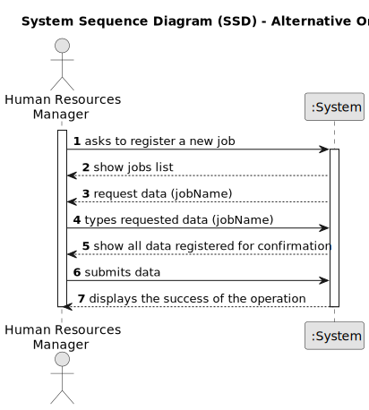

# US002 - Job Registration

## 1. Requirements Engineering

### 1.1. User Story Description

As a Human Resources Manager I want to register a job.

### 1.2. Customer Specifications and Clarifications 

**From the specifications document and client meetings:**

>	Each job is characterized by having a unique name. 

>	There can not be duplicated professions.

**From forum:**

> **Question:** What are the acceptance criteria? When creating a job that already exits, what does the system do?
>
> **Answer:** By definition a set can't have duplicates. Assuring no duplicates is not a business rule is a technical issue.

> **Question:** Which are the data for the creation of a profession?
>
> **Answer:** The name of it: Gardener, Driver, Cobbler, Electrician...

> **Question:** Is it relevant to associate a specific area or sector with each Job? (For example, "Gardener" would be inserted in the "Maintenance" sector).
>
> **Answer:** Is not necessary as there is no US to suggest that it might be necessary.

> **Question:** Can special characters and numbers be entered when registering a job?
>
> **Answer:** No.

  > **Question:** I guess a job can be assigned to a collaborator if he has the skills require for this job. How do we manage this relation. Does he HRM do it manually, or should we have an attribute in job specifying the skills needed?
>
> **Answer:** No; a collaborator is hired for a job and can have skills or not.

### 1.3. Acceptance Criteria
* **AC01:** The system should validate that the job name provided by the user is not empty.
* **AC02:** The system should not allow special characters or numbers in the job name. If special characters or numbers are entered, the system should return an error message indicating that only alphabetic characters are allowed.
* **AC03:** All required fields must be filled in (the name is this case).

### 1.4. Found out Dependencies

* No dependencies found.

### 1.5 Input and Output Data

**Input Data:**

* Typed data:
    * a job name

**Output Data:**
* List of professions stored and added to the system
* (In)Success of the operation

### 1.6. System Sequence Diagram (SSD)

#### Alternative One

### 1.7 Other Relevant Remarks

* None
