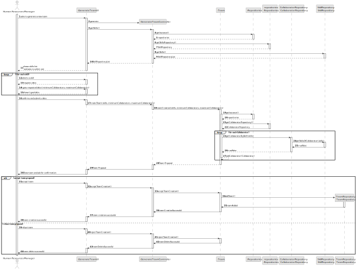

# US005 - Generate a team proposal automatically

## 3. Design - User Story Realization 

### 3.1. Rationale

_**Note that SSD - Alternative One is adopted.**_

| Interaction ID                                 | Question: Which class is responsible for...           | Answer                 | Justification (with patterns)                                                                                 |
|:-----------------------------------------------|:------------------------------------------------------|:-----------------------|:--------------------------------------------------------------------------------------------------------------|
| Step 1 : asks to generate team		               | 	... interacting with the actor?                      | GenerateTeamUI         | Pure Fabrication: there is no reason to assign this responsibility to any existing class in the Domain Model. |
| 			  		                                        | 	... coordinating the US?                             | GenerateTeanController | Controller                                                                                                    |
| Step 2 : shows list of skills		                | 	... displaying the skill list?						                 | GenerateTeamUI         | Pure Fabrication: there is no reason to assign this responsibility to any existing class in the Domain Model. |
| Step 3 : requests skills		                     | 	... displaying the skill selected before submitting? | GenerateTeamUI         | Pure Fabrication: there is no reason to assign this responsibility to any existing class in the Domain Model. |
| Step 4 : submits skills		                      | 	... generating the team object?                      | TeamRepository         | Creator (Rule 1): in the DM TeamRepository has team                                                           |
|                                                | ... validating all data?                              | TeamRepository         | IE : knows all its skills                                                                                     |           
|                                                | ... saving the team generated?                        | TeamRepository         | IE : knows all its teams                                                                                      |
| Step 5 : the team generated		                  | 	... accepting the team generated?                    | GenerateTeamUI         | is responsible for user interactions                                                                          |
|                                                |  ... refuse the team generated? | GenerateTeamUI         | is responsible for user interactions                                                                          |
| Step 6 : confirms the success of the operation | ... informing the operation success? | GenerateTeamUI         | is responsible for user interactions                                                                          |

### Systematization ##

According to the taken rationale, the conceptual classes promoted to software classes are: 

* Team
* TeamRepository
* Skill
* SKillRepository
* Collaborator
* CollaboratorRepository

Other software classes (i.e. Pure Fabrication) identified: 

* GenerateTeamUI  
* GenerateTeamController

## 3.2. Sequence Diagram (SD)

_**Note that SSD - Alternative Two is adopted.**_

### Full Diagram

This diagram shows the full sequence of interactions between the classes involved in the realization of this user story.

### Split Diagrams

The following diagram shows the same sequence of interactions between the classes involved in the realization of this user story, but it is split in partial diagrams to better illustrate the interactions between the classes.

It uses Interaction Occurrence (a.k.a. Interaction Use).

**Get Task Category List Partial SD**

**Get Task Category Object**

**Get Employee**

**Create Task**

## 3.3. Class Diagram (CD)

