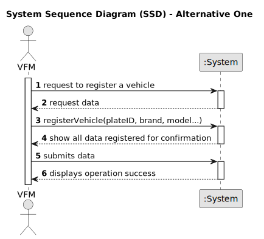

# US006 - Registering Vehicles

## 1. Requirements Engineering

### 1.1. User Story Description

As an VFM, I wish to register a vehicle including Brand, Model, Type, Tare, Gross Weight, Current Km, Register Date, Acquisition Date, Maintenance/Checkup Frequency (in Kms).
### 1.2. Customer Specifications and Clarifications 

**From the specifications document and client meetings:**

> Register vehicles within the system to effectively manage the fleet utilized in maintaining green spaces. 

> This registration process should capture crucial details including the brand, model, type, tare weight, gross weight, current kilometers, register date, acquisition date, and the maintenance/check-up frequency measured in kilometers.

**From forum:**

> **Question:** Should the application identify a registered vehicle by a serial number or other attribute?
>
> **Answer:** By plate id;

> **Question:** Should the application a group the vehicles by their brand, serial number or other attribute?
>
> **Answer:** No requirements were set concerning groups of vehicles;

> **Question:** If the FM inserts the same vehicle by mistake, should it inform their user of the mistake and give him the option to add another vehicle?
>
> **Answer:** Duplication of data is not a business rule is technical one, since by definition in a set you cant have duplicates;

> **Question:** For the application to work does the FM need to fill all the attributes of the vehicle?
>
> **Answer:** yes, besides the vehicle plate that by mistake doesn't appear on the text;

> **Question:** Can an FM register no vehicles or does he have to register at least one?
>
> **Answer:** In theory If there is no need to register a vehicle, no vehicles will be registered but that would be rather odd;

> **Question:** When a vehicle is registered, are there specific requirements for accepting the brand? For example, does the system need to check if the brand is on a predetermined list? Does this also apply to the model or any other characteristics?
>
> **Answer:** no; one can consider a list os brands and a list of models previously inserted in the system, no need to go through validations;

> **Question:** What are the validation requirements for the vehicle ID?
>
> **Answer:** After 2020: AA-00-AA / between 2005-2020 00-AA-00 / between 1992-2005 00-00-XX

### 1.3. Acceptance Criteria

* **AC01:** When registering a vehicle the identity of this should be the number plate.
* **AC02:** There cannot be two cars with the same plate number.
* **AC03:** All required fields must be filled in (Plate, Brand, Model, Type...).
* **AC04:** The Maintenance/Checkup Frequency must be field in Kms.
* **AC05:** The Plate ID must follow the format of the corresponding year.
* **AC06:** The Tare Weight must be lower than the Gross Weight.
* **AC07:** The last check-up km must be lower than the current km.
* **AC08:** The register date must be lower than the acquisition date.
* **AC09:** The inputted data must correspond to the expected data type.

### 1.4. Found out Dependencies

* No dependencies found.

### 1.5 Input and Output Data

**Input Data:**

* Typed data:
    * a number plate
    * the brand of the car
    * the model of the car
    * the tare weight
    * a gross weight
    * the current Km
    * Checkup Frequency (in Kms)
    * last check-up
    * a register date
    * the Acquisition Date of the vehicle

* Selected data:
    * the type of the vehicle

**Output Data:**

* List of types of vehicles
* Confirmation menu
* Success of the operation
* Errors/warnings messages

### 1.6. System Sequence Diagram (SSD)

### 1.7 Other Relevant Remarks
