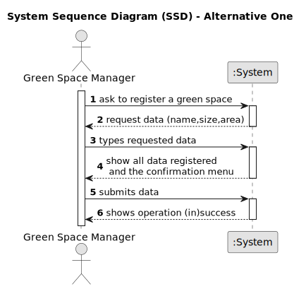

# US020 - Register a Green Space

## 1. Requirements Engineering

### 1.1. User Story Description

As a Green Space Manager, I want to register a green space.

### 1.2. Customer Specifications and Clarifications 

**From the specifications document and client meetings:**

>As a Green Space Manager (GSM), I want to register a green space (garden, medium-sized park or large-sized park) and its respective
area.

**From forum:**

> **Question:** To register a green space, what is the criteria needed to classify it as a medium-sized park or a large-sized park?
>
> **Answer:** It's a GSM responsibility to decide the classification.

> **Question:** We understand that type (garden, medium-size, large-size), area, name, and address are required inputs for a Green Space (and if we are wrong in this, please correct us), but are there any other inputs that we are unaware of?
>
> **Answer:** Seems enough.

> **Question:** In which unit should the area be measured in?
>
> **Answer:** Usually, areas are measured in hectares.

> **Question:** Can two different green spaces have the same address?
>
> **Answer:** No.

> **Question:** Can two green spaces have the same name?
>
> **Answer:** No.

### 1.3. Acceptance Criteria 

* **AC01:** There cannot be two green spaces with the same "name" or "address".
* **AC02:** All required fields must be filled in.
* **AC03:** The "name" of a green space cannot have special characters.
* **AC04:** When a certain GSM create a GS this must be associate to the same park.
* **AC05:** The "size" of a GS must be one of the following options : [Garden, Medium,Large].
* **AC06:** The "area" of the GS can't be negative or zero.
* **AC07:** The "name" and "address" of the GS can't be only form of blank spaces.

### 1.4. Found out Dependencies

* None.

### 1.5 Input and Output Data

**Input Data:**

* Typed Data:
  * Name of the Green Space.
  * Address of the Green Space.
  * Area of the Green Space.
  * The system automatically associates the GSM responsible for the park created.
* Selected Data:
  * Size of the Green Space.

**Output Data:**

* Confirmation menu.
* List of sizes
* (In)Success of the operation.
* Option to repeat process in case of failure.
* Error messages.

### 1.6. System Sequence Diagram (SSD)

#### Alternative One

