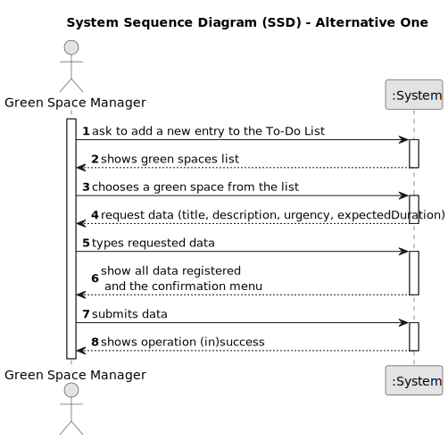

# US021 - Adding a To-Do List Entry for Green Space Management

## 1. Requirements Engineering

### 1.1. User Story Description

As a GSM, I want to add a new entry to the To-Do List.

### 1.2. Customer Specifications and Clarifications 

**From the specifications document and client meetings:**

>	The entries in this list describe the required task, the degree of urgency (High, Medium, and Low), and the approximate expected duration.

>   The To-Do List comprises all pending tasks for all parks.

**From forum:**

> **Question:** What time unit should be used for the duration of the task?
> 
> **Answer:**  Hour and/or days.    

> **Question:**
Is it mandatory for the program to have multiple GSM? If so, should each green space be associated with a responsible GSM? In other words, can only the GSM assigned to a specific green space register a new entry for the to-do list?
>
> **Answer:** The program can have multiple GSM. Yes. Yes.

> **Question:** If there are multiple GSM in the system, can a GSM create an entry for a Green Space managed by another GSM?
>
> **Answer:** No

> **Question:** For a regular task, should the GSM define the frequency in which the tasks needs to be performed?
>
> **Answer:** Not for this sprint

> **Question:** Should the to-do entries be unique or can a GSM repeat the same to-do entry, for the same Green Space, multiple times
>
> **Answer:** Yes; Assuming the previous task with same description was previously processed and is not open anymore.

> **Question:** If the To-Do entry is assigned to the Agenda, should it be removed for the To-Do entry, if it only occasional?
>
> **Answer:** Should change the status to processed.

> **Question:** What are the details the GSM needs to input, other than the Green Space, frequency, estimated duration? Title and description are required?
>
> **Answer:** Title and description could be useful.

> **Question:** Should the GSM define the skills needed for a To-Do entry?
>
> **Answer:** No but maybe it should be done for type of task (or similar)

### 1.3. Acceptance Criteria 

* **AC1:** The new entry must be associated with a green space managed by the GSM.
* **AC2:** The green space for the new entry should be chosen from a list presented to the GSM.
* **AC3:** The entry must specify the degree of urgency (High, Medium, Low).
* **AC4:** The entry must provide an approximate expected duration for the task.

### 1.4. Found out Dependencies

* There is a dependency on "US020 - Register a Green Space" as there must be at least one green space created.

### 1.5 Input and Output Data

**Input Data:**

* Title
* Description
* Duration for the task

**Selected Data:**

* Green Space ID
* Degree of urgency

**Output Data:**

* (In)Success of the operation

### 1.6. System Sequence Diagram (SSD)

#### Alternative One

