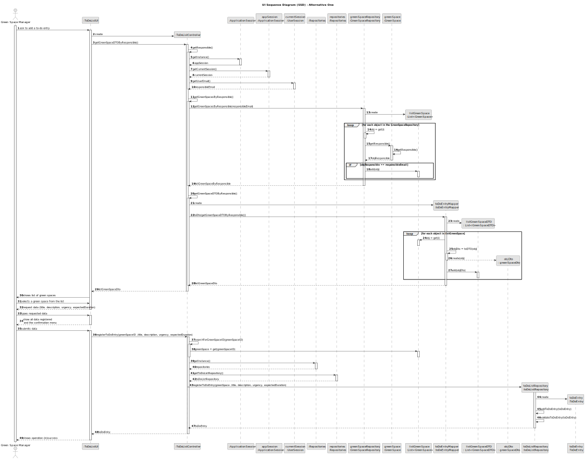
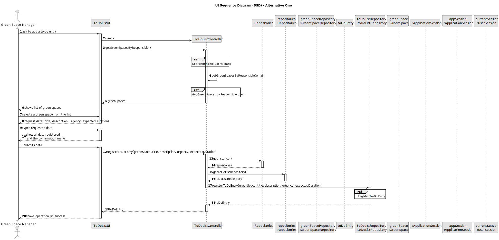
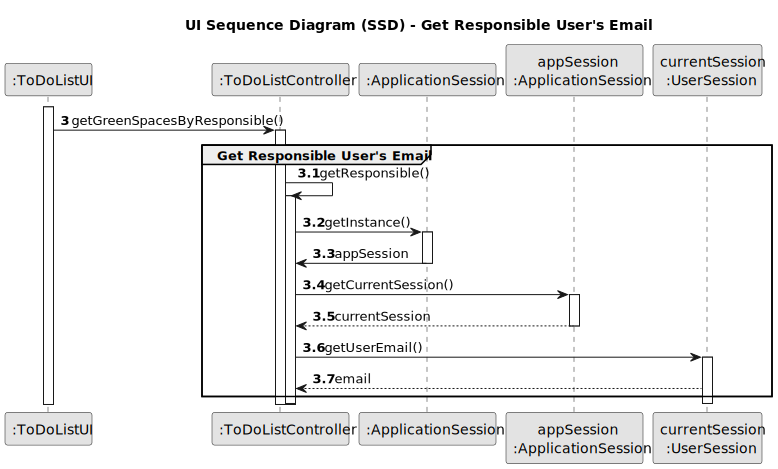
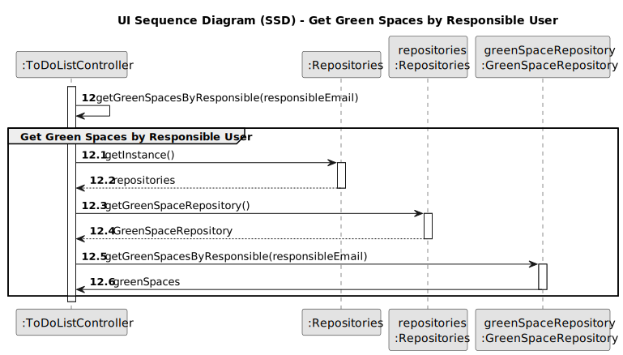
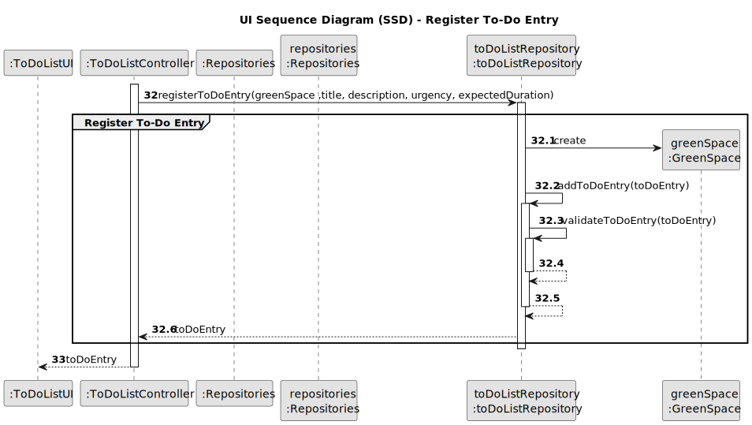

# US021 - Adding a To-Do List Entry for Green Space Management

## 3. Design - User Story Realization

### 3.1. Rationale

| Interaction ID | Question: Which class is responsible for...                 | Answer                | Justification (with patterns)                                                                                                             |
|:---------------|:------------------------------------------------------------|:----------------------|:------------------------------------------------------------------------------------------------------------------------------------------|
| Step 1         | ... interacting with the actor?                             | ToDoListUI            | Pure Fabrication: A UI component typically handles user interactions and acts as an interface between the user and the system.            |
|                | ... coordinating the use case?                              | ToDoListController    | Controller: The controller orchestrates the use case by coordinating the interactions between the UI and the domain model.                |
| Step 2         | ... getting the current session instance?                   | ApplicationSession    | Singleton: The session instance is retrieved using the Singleton pattern to ensure a single instance throughout the application.           |
|                | ... getting the current user session?                       | ApplicationSession    | Controller: The controller retrieves the current session details to determine the responsible user's email.                               |
| Step 3         | ... getting the responsible user's email?                   | UserSession           | Controller: The controller retrieves the email from the user session to identify the responsible user.                                     |
| Step 4         | ... getting the green spaces by the responsible user?       | GreenSpaceRepository  | Repository: The repository pattern encapsulates the logic for retrieving green spaces managed by the responsible user.                     |
| Step 5         | ... retrieving the green space repository instance?         | Repositories          | Singleton: The repository instance is retrieved using the Singleton pattern to ensure a single instance throughout the application.        |
| Step 6         | ... showing the list of green spaces to the actor?          | ToDoListUI            | Pure Fabrication: The UI component is responsible for presenting the list of green spaces to the user.                                     |
| Step 7         | ... registering the to-do entry?                            | ToDoListRepository    | Repository: The repository pattern encapsulates the logic for data access, in this case, registering a new to-do entry.                    |
| Step 8         | ... creating a new to-do entry?                             | GreenSpace            | Entity: The GreenSpace entity is used to encapsulate the creation of a new to-do entry within its context.                                  |
| Step 9         | ... adding the to-do entry to the repository?               | ToDoListRepository    | Repository: The repository handles the addition of new to-do entries, ensuring data persistence and integrity.                             |
| Step 10        | ... validating the to-do entry?                             | ToDoListRepository    | Repository: The repository ensures that the new to-do entry meets the required criteria before saving it.                                  |
| Step 11        | ... sending the to-do entry to the controller?              | ToDoListRepository    | Repository: The repository encapsulates the logic for data access, sending the validated to-do entry back to the controller.               |
| Step 12        | ... showing the result of the operation to the actor?       | ToDoListUI            | Pure Fabrication: The UI component presents the outcome of the operation (success or failure) to the user.                                 |

### Systematization

According to the taken rationale, the conceptual classes promoted to software classes are:

* GreenSpace (Entity)
* ApplicationSession (Singleton)
* UserSession (Entity)

Other software classes (i.e. Pure Fabrication) identified:

* ToDoListController
* ToDoListUI
* GreenSpaceRepository
* ToDoListRepository
* Repositories (Singleton)

## 3.2. Sequence Diagram (SD)

### Full Diagram

This diagram shows the full sequence of interactions between the classes involved in the realization of this user story.

### Split Diagrams

The following diagram shows the same sequence of interactions between the classes involved in the realization of this
user story, but it is split in partial diagrams to better illustrate the interactions between the classes.

It uses Interaction Occurrence (a.k.a. Interaction Use).

**Get Responsible User's Email Partial SD**

**Get Green Spaces by Responsible User Partial SD**

**Register To-Do Entry Partial SD**

## 3.3. Class Diagram (CD)

