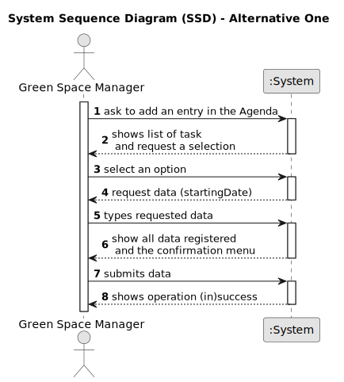

# US022 - Add a new entry in the Agenda

## 1. Requirements Engineering

### 1.1. User Story Description

As a GSM, I want to add a new entry in the Agenda.

### 1.2. Customer Specifications and Clarifications 

**From the specifications document and client meetings:**

>	None.

**From forum:**

> **Question:** When a new entry is added to the Agenda, the status of that task will be, by default, set to "planned", right?
>
> **Answer:**  "Planned" as default for Agenda entries, sounds good.

> **Question:** Some tasks are meant to be reoccurring rather than occasional. Is this something that should be asked on creating the task in the to-do list? If so, what inputs should we expect from the user?
>
> **Answer:** For the current proof-of-concept there is no need to distinguish between recurring and occasional tasks.

> **Question:** When the GSM plans a task (that was previously in To-Do) into the Agenda, what aditional data/information does he need to input when planning?
>
> **Answer:** The starting date for the task. Later the GSM will be able to add the Team and vehicles (if required).

> **Question:** When a To-Do List entry is planned and moves to the Agenda, the status change from "Pending" to "Planned". Should this entry be removed from the To-Do List or just change status to "Planned" as it is on the Agenda?
>
> **Answer:** Changing the status in the To-Do list to Planned seems to be a good approach.

> **Question:** When we are registering an entry to the agenda, are the three inputs (selecting an existing task from the to-do list, starting date, and finishing date) sufficient?
>
> **Answer:** The starting date will be enough because the task already has the predicted duration.

> **Question:** Can I add an entry that has a time period that already have an existing entry in the Agenda?
> 
> **Answer:** Yes, because:
a) there are many parks to manage
b) different tasks can be executed at same time in the same park.

### 1.3. Acceptance Criteria 

* **AC1:** The new entry must be associated with a green space managed by the GSM.
* **AC2:** The new entry must exist in the To-Do list.
* **AC3:** The new entry must change the "Task status" to "Planned".
* **AC4:** When adding an entry in the agenda, this doesn't need to be eliminated from the "TODO list"
* **AC5:** Both "Team" and "Vehicles" would be associate later, no need to be introduced now.
* **AC6:** The "end Date" must be obtained from the calculus between "Starting Date" introduce and the "Expected Duration" of the task. 

### 1.4. Found out Dependencies

* There is a dependency on "US020 - Register a Green Space" as there must exist green spaces in the system so that it can be associated with an entry in the Agenda.
* There is a dependency on "US021 - Add a new entry to the to-do list" as there must exist tasks in the to-do list so that it can be associated to the Agenda.

### 1.5 Input and Output Data

**Input Data:**

* Typed Data:
  * Starting Date
* Selected Data:
  * Task from ToDo List

**Output Data:**

* Confirmation menu.
* List of Task in the ToDo List
* (In)Success of the operation.
* Error messages.

### 1.6. System Sequence Diagram (SSD)

#### Alternative One

