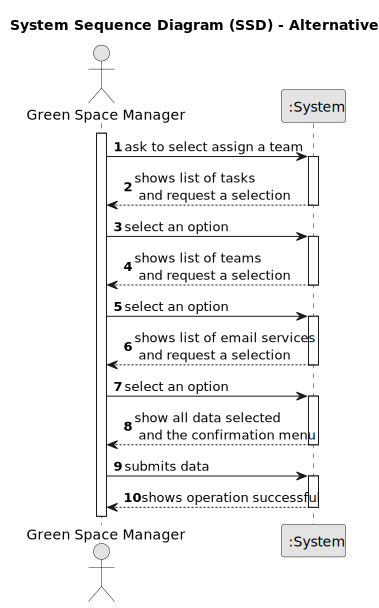

# US0023 -  Assign a Team to an entry in the Agenda

## 1. Requirements Engineering

### 1.1. User Story Description

As a GSM, I want to assign a Team to an entry in the Agenda
### 1.2. Customer Specifications and Clarifications 

**From the specifications document and client meetings:**

> The Agenda is made
up of entries that relate to a task (which was previously in the To-Do List),
the team that will carry out the task, the vehicles/equipment assigned to
the task, expected duration, and the status (Planned, Postponed, Canceled,
Done).
 

**From forum:**

> **Question:** When I choose to associate a team with an agenda entry, is there a maximum number of team members? Are the team members collaborators, GSM...? We can choose them through their email, right?
>
> **Answer:** Have you ever read the text of the US05 concerning the generation of Teams?

> **Question:** Can an entry in the Agenda that already has a Team assigned be reassigned another Team?  Also, an entry that has been Postponed, Canceled or Done shouldn't be available to get a Team assigned, correct? Thank you
>
> **Answer:**

> **Question:** Also only the GSM responsible for the Green Space associated with the entry can assign the team to that entry? Thank you
>
> **Answer:**

> **Question:** Good afternoon. Can an Agenda entry have more than one team assigned to it?  Best regards.
>
> **Answer:** No.

> **Question:**  Can a Team be assigned to multiple entrys?  Best Regards.

> **Answer:** yes.

> **Question:** Good afternoon. In this US, can any GSM do the action of assigning a Team to the entry in the agenda? Or it must be the GSM that created that entry? Or the GSM responsible for the green space associated with that entry? Best regards.
>
> **Answer:**

> **Question:** Good afternoon, Regarding US22 and 23:1 - Tasks have a status of Planned, Postponed, Canceled or Done. When do they pass to "Planned" status? When they are added to the agenda (before the GSM assigns a team) or when a team is assigned to them? 2 - Task duration should be considered in hours or in half days (morning/afternoon)? Thank you for your time. Best regards, Tiago Sá
>
> **Answer:** Hi, The use of states and their values ​​is a technical modeling issue, it is not the client's responsibility. Assuming you are using states, a task would become "Planned" as soon as it enters the Agenda. Hours should be ok, but keep in mind, that the storage format doesn't need to be same as the input/output format.

### 1.3. Acceptance Criteria 

* **AC1** Must have tasks in the agenda entry to assign the team
* **AC2** Must have teams to assign to an agenda entry
* **AC3** Must be at least one email service in configuration file.
* **AC4** In order to add more email services in the configuration file it should fulfill all parameters in terms of data and names, as the following example:
"
  email_service.isep.ipp.pt.smtp_server_name = isep_ipp_pt
  email_service.isep_ipp_pt.smtp_server = smtp.isep.ipp.pt
  email_service.isep_ipp_pt.port = 587
  email_service.isep_ipp_pt.use_tls = true
  email_service.isep_ipp_pt.use_ssl = false
"
* **AC5** A team can be assigned to multiple entries but an agenda entry can only have one team assigned
* **AC6** The configuration file should remain inside "~/src/main/resources" directory in order to function

### 1.4. Found out Dependencies

* There is a dependency on "US005 - Generate Team" as there must be at least one team in the system so that it can associate it to an agenda entry.
* There is a dependency on "US022 - Add a new entry in the Agenda" as there must be at least one entry in agenda, in the system so that it can associate a team to it.

### 1.5 Input and Output Data

**Input Data:**

* Selected Data
  * Team number
  * Agenda entry
  * Email Service

**Output Data:**

* Email to all team members
* Success of the operation

### 1.6. System Sequence Diagram (SSD)

#### Alternative One

