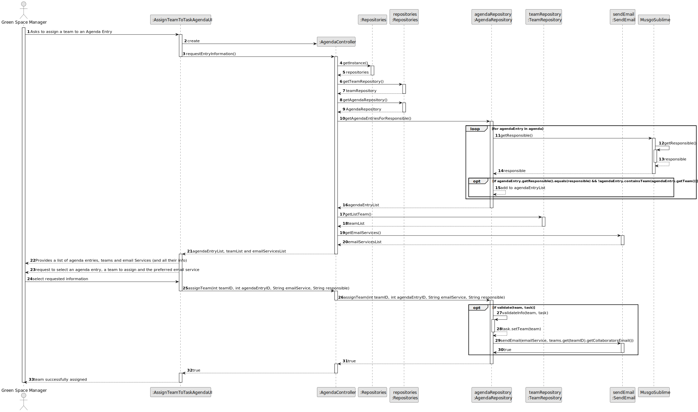
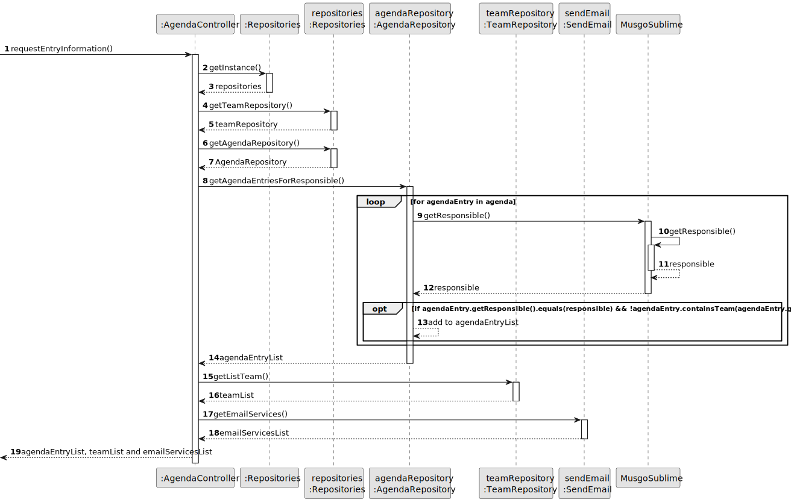
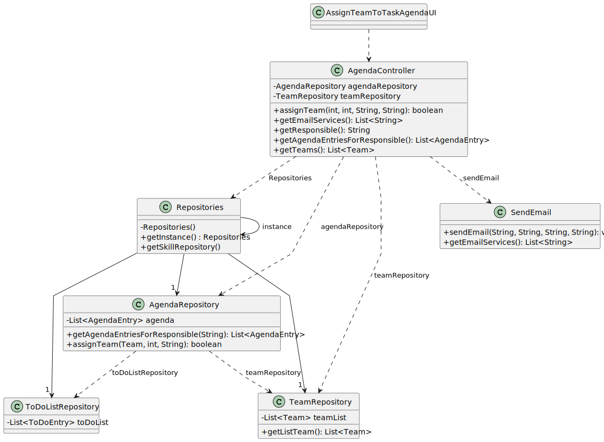

# US0023 -  Assign a Team to an entry in the Agenda

## 3. Design - User Story Realization

### 3.1. Rationale

| Interaction ID | Question: Which class is responsible for...                    | Answer                    | Justification (with patterns)                                                                                                              |
|:---------------|:---------------------------------------------------------------|:--------------------------|:-------------------------------------------------------------------------------------------------------------------------------------------|
| Step 1         | ... interacting with the actor?                                | AssignTeamToTaskAgendaUI  | Pure Fabrication: A UI component typically handles user interactions and acts as an interface between the user and the system.             |
|                | ... coordinating the US?                                       | AgendaController          | Controller: The controller orchestrates the use case by coordinating the interactions between the UI and the domain model.                 |
| Step 2         | ... coordinating with the repositories?                        | AgendaController          | Controller: The controller interacts with repositories to retrieve necessary data and perform business logic.                              |
|                | ... retrieving the agenda repository?                          | AgendaController          | Controller: The controller interacts with the repositories to retrieve the necessary data for the use case.                                |
| Step 3         | ... getting the agenda entries for the responsible?            | AgendaRepository	         | 	Repository: The repository pattern encapsulates the logic for retrieving data, in this case, agenda entries for the responsible.          |
| Step 4         | ... iterating over each agenda entry?                          | AgendaRepository          | Repository: The repository handles the retrieval and manipulation of data, iterating over agenda entries.                                  |
|                | ... determining if an agenda entry needs a team?               | AgendaRepository          | Repository: The repository pattern encapsulates the logic for data access and business logic, determining agenda entry status.             |
| Step 5         | ... retrieving the teams?                                      | TeamRepository            | Repository: The repository pattern encapsulates the logic for data access, retrieving teams.                                               |
| Step 6         | ... validating data?                                           | AgendaRepository          | 	Repository: The repository pattern encapsulates the logic for data access and validation, ensuring data integrity.                        | 
|                | ... saving the assigned team to the agenda entry?              | AgendaRepository          | 	Repository: The repository pattern encapsulates the logic for data access and manipulation, saving the assigned team.                     | 
| Step 7         | ... sending the list of agenda entries and teams to the actor? | AssignTeamToTaskAgendaUI  | 	Pure Fabrication: The UI component is responsible for presenting information to the user and is a separate concern from the domain logic. |

### Systematization ##

According to the taken rationale, the conceptual classes promoted to software classes are:

* None

Other software classes (i.e. Pure Fabrication) identified:

* AgendaController
* AssignTeamToTaskAgendaUI
* AgendaRepository
* TeamRepository
* SendEmail

## 3.2. Sequence Diagram (SD)

### Full Diagram

This diagram shows the full sequence of interactions between the classes involved in the realization of this user story.

### Split Diagrams

The following diagram shows the same sequence of interactions between the classes involved in the realization of this
user story, but it is split in partial diagrams to better illustrate the interactions between the classes.

It uses Interaction Occurrence (a.k.a. Interaction Use).

## 3.3. Class Diagram (CD)

