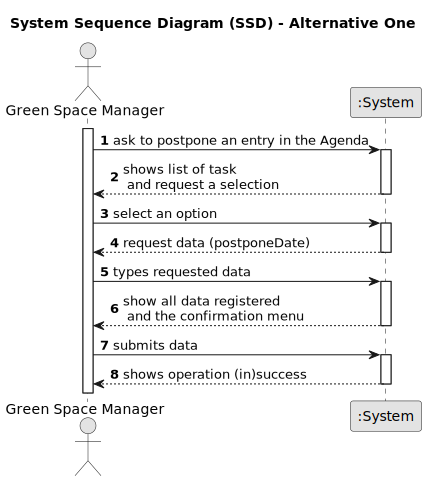

# US024 - Postpone task in Agenda

## 1. Requirements Engineering

### 1.1. User Story Description

As a GSM, I want to Postpone an entry in the Agenda to a specific future date.

### 1.2. Customer Specifications and Clarifications 

**From the specifications document and client meetings:**

None.

**From forum:**

> **Question:** What are the input to postpone an entry? From my perspective the Green Spaces Manager only needs to select the entry and introduce the new date.
>
> **Answer:** Yes, you are correct!

> **Question:** The selected task(s) will be postponed by one interval defined by the user or for the next day?
>
> **Answer:** When postponing a task, the new predicated date for execution should be inserted.

> **Question:** The date you want to postpone in this US24 is the date referring to the "approximate expected duration" field when we registered the task?
>
> **Answer:**
No; sometimes, for various reasons (e.g. insufficient staff, faulty equipment or adverse weather conditions) a task has to be postponed to a new date; task duration is not directly related to this.

### 1.3. Acceptance Criteria 

* **AC1:** The task selected to be postponed can't have the status of "Canceled", if so, no changes are made.
* **AC2:** The task must be selected from the list show by the UI, for the respective user log in on the system.
* **AC3:** When postponed a task, its status does not change.
* **AC4:** The input date, have to be gratter than the associated to the task.

### 1.4. Found out Dependencies

* There is a dependency on "US022 - Add a new entry in the Agenda" as there must be at least one task in the Agenda so that one of this can be postponed.

### 1.5 Input and Output Data

**Input Data:**

* Typed Data:
    * Postpone Date
* Selected Data:
    * Task from Agenda

**Output Data:**

* Confirmation menu.
* List of Task in the Agenda
* (In)Success of the operation.
* Error messages.

### 1.6. System Sequence Diagram (SSD)

#### Alternative One

