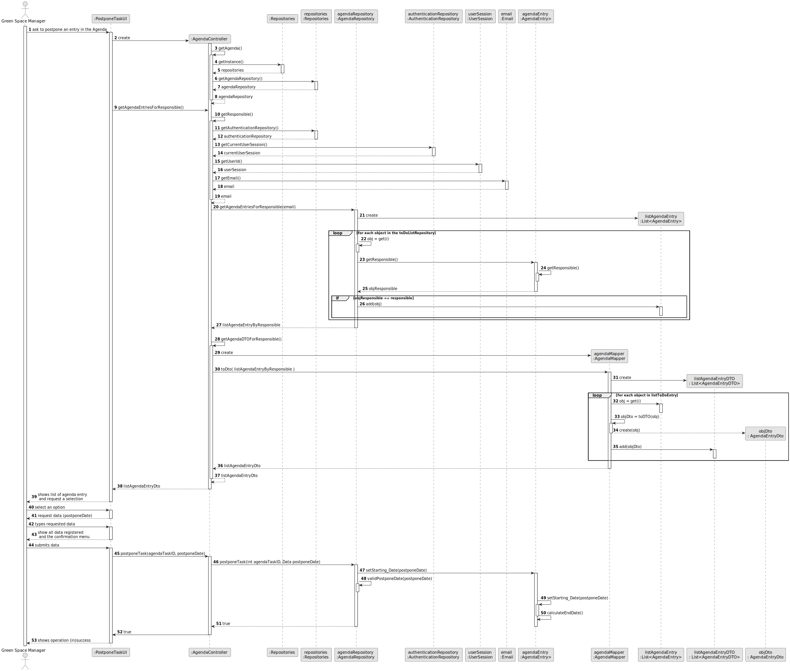
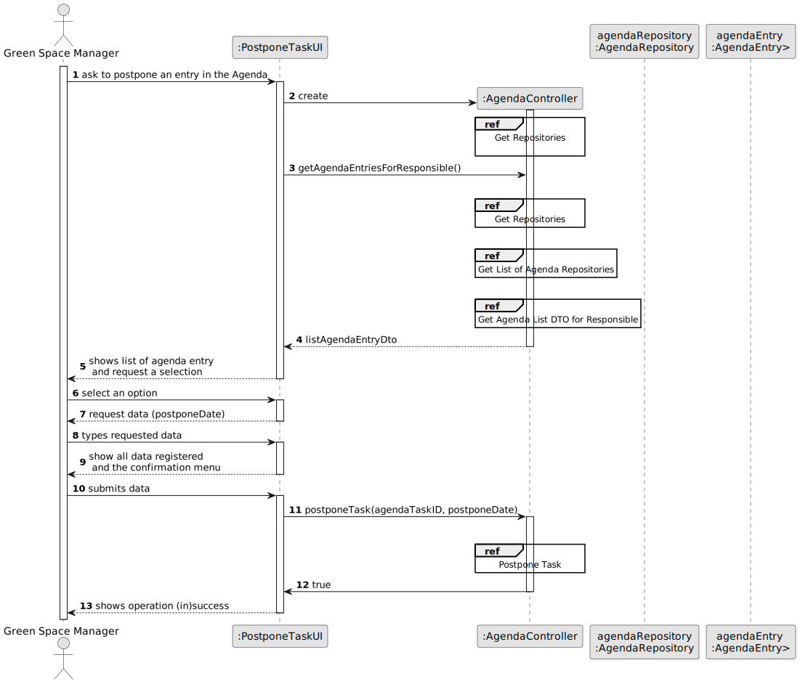
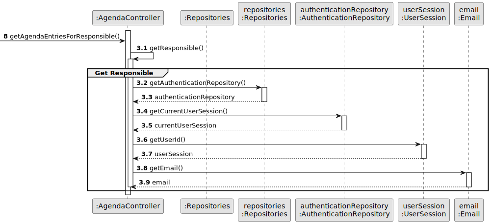
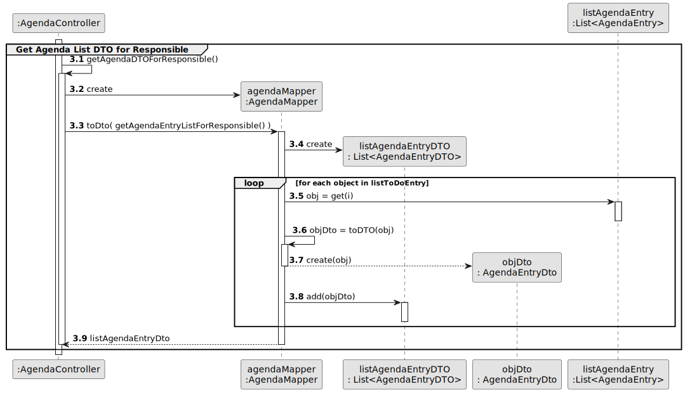
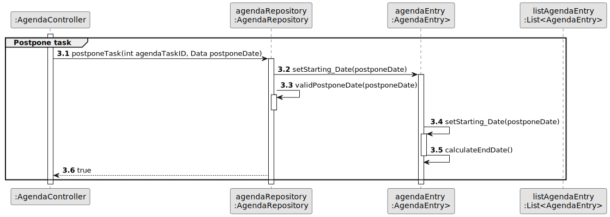
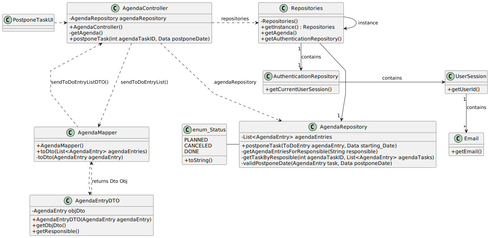

# US024 - Postpone task in Agenda

## 3. Design - User Story Realization

### 3.1. Rationale

| Interaction ID | Question: Which class is responsible for...                | Answer               | Justification (with patterns)                                                                                                   |
|:---------------|:-----------------------------------------------------------|:---------------------|:--------------------------------------------------------------------------------------------------------------------------------|
| Step 1         | ... interacting with the actor?                            | PostponeTaskAgendaUI | Pure Fabrication: A UI component typically handles user interactions and acts as an interface between the user and the system.  |
|                | ... coordinating the US?                                   | AgendaController     | Controller: The controller orchestrates the use case by coordinating the interactions between the UI and the domain model.      |
|                | ... knowing the user using the system?                     | UserSession          | IE: cf. A&A component documentation.                                                                                            |
| Step 2         | ... displaying the list for the actor to select an option? | PostponeTaskAgendaUI | Pure Fabrication                                                                                                                |
| Step 3         | ... temporarily keeping the input option?                  | PostponeTaskAgendaUI | Pure Fabrication                                                                                                                |
| Step 4         | ... displaying the form for the actor to input data?       | PostponeTaskAgendaUI | Pure Fabrication                                                                                                                |
| Step 5         | ... temporarily keeping the input option?                  | PostponeTaskAgendaUI | Pure Fabrication                                                                                                                |
| Step 6         | ... display all the information before submitting?         | PostponeTaskAgendaUI | Pure Fabrication.                                                                                                               |
| Step 7         | ... postponing the date?                                   | AgendaRepository     | Repository: The repository handles the retrieval and manipulation of data, iterating over the existent Tasks in the repository. |              
| 	              | ... validating all data (global validation)?               | AgendaRepository     | IE: knows all its information.                                                                                                  |
| 	              | ... saving the new postponed date?                         | AgendaRepository     | IE: owns all its Task.                                                                                                          |
| Step 8         | ... informing operation success?                           | PostponeTaskAgendaUI | IE: is responsible for user interactions.                                                                                       | 

### Systematization ##

According to the taken rationale, the conceptual classes promoted to software classes are:

* AgendaRepository

Other software classes (i.e. Pure Fabrication) identified:

* AgendaController
* PostponeTaskAgendaUI

## 3.2. Sequence Diagram (SD)

### Full Diagram

This diagram shows the full sequence of interactions between the classes involved in the realization of this user story.

### Split Diagrams

The following diagram shows the same sequence of interactions between the classes involved in the realization of this
user story, but it is split in partial diagrams to better illustrate the interactions between the classes.

It uses Interaction Occurrence (a.k.a. Interaction Use).

**Get Agenda Repository**

**Get Responsible**

**Get List of Agenda Repositories**

**Get Agenda List DTO for Responsible**

**Postpone Task**

## 3.3. Class Diagram (CD)

