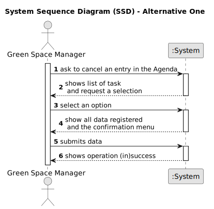

# US025 - Cancel entry in Agenda

## 1. Requirements Engineering

### 1.1. User Story Description

- As a GSM, I want to Cancel an entry in the Agenda.

### 1.2. Customer Specifications and Clarifications 

**From the specifications document and client meetings:**

>	The system should prompt all the task for the respective responsible.

**From forum:**

> **Question:** When the GSM wants to cancel a task, this task can only be canceled if its status is PLANNED or POSTPONED, correct?
>
> **Answer:**  No, just planned because if there is a Postponed entry then there is also a Planned Entry with the new date.

### 1.3. Acceptance Criteria 

* **AC1:** The task selected to be postponed only can have the status of "Planned" to be available to be canceled.
* **AC2:** The task must be selected from the list show by the UI, for the respective user log in on the system.
* **AC3:** When Canceling a task, its status does change to "Canceled".

### 1.4. Found out Dependencies

* There is a dependency on "US022 - Add a new entry in the Agenda" as there must be at least one task in the Agenda so that one of this can possibly be canceled.

### 1.5 Input and Output Data

**Input Data:**

* Selected Data:
    * Task from Agenda to be canceled

**Output Data:**

* Confirmation menu.
* List of Task in the Agenda
* (In)Success of the operation.
* Error messages.

### 1.6. System Sequence Diagram (SSD)

#### Alternative One

