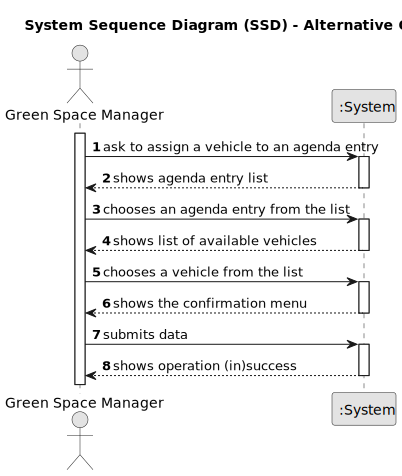

# US026 - Assign One or More Vehicles to Agenda Entry

## 1. Requirements Engineering

### 1.1. User Story Description

As a GSM, I want to assign one or more vehicles to an entry in the Agenda.

### 1.2. Customer Specifications and Clarifications 

**From the specifications document and client meetings:**

>	None.

**From forum:**

> **Question:** Should all company vehicles be available to assign them to a calendar entry, or only vehicles with up-to-date maintenance?
>
> **Answer:**  All vehicles that are not assigned to a task in the same period.
In a real context, we would also need to manage the (un)availability of vehicles due to overhauls or breakdowns, but this is not necessary in this proof-of-concept.

> **Question:** It is possible to add any kind of vehicles?
>
> **Answer:** Yes, any kind of vehicles can be assigned.

### 1.3. Acceptance Criteria 

* **AC1:** The new vehicle entry must be associated with an Agenda managed by the GSM.
* **AC2:** The Agenda Entry for the new vehicle entry should be chosen from a list presented to the GSM.
* **AC3:** Only available vehicle must be assigned to the Agenda Entry.

### 1.4. Found out Dependencies

* There is a dependency on "US006 - Registering Vehicles" as there must be at least one vehicle created.
* There is a dependency on "US020 - Register a Green Space" as there must be at least one green space created.
* There is a dependency on "US021 - Adding a To-Do List Entry for Green Space Management" as there must be at least one to-do entry created.
* There is a dependency on "US022 - Add a new entry in the Agenda" as there must be at least one agenda entry created.

### 1.5 Input and Output Data

**Input Data:**

* PlateID

**Selected Data:**

* Agenda Entry ID

**Output Data:**

* (In)Success of the operation

### 1.6. System Sequence Diagram (SSD)

#### Alternative One

