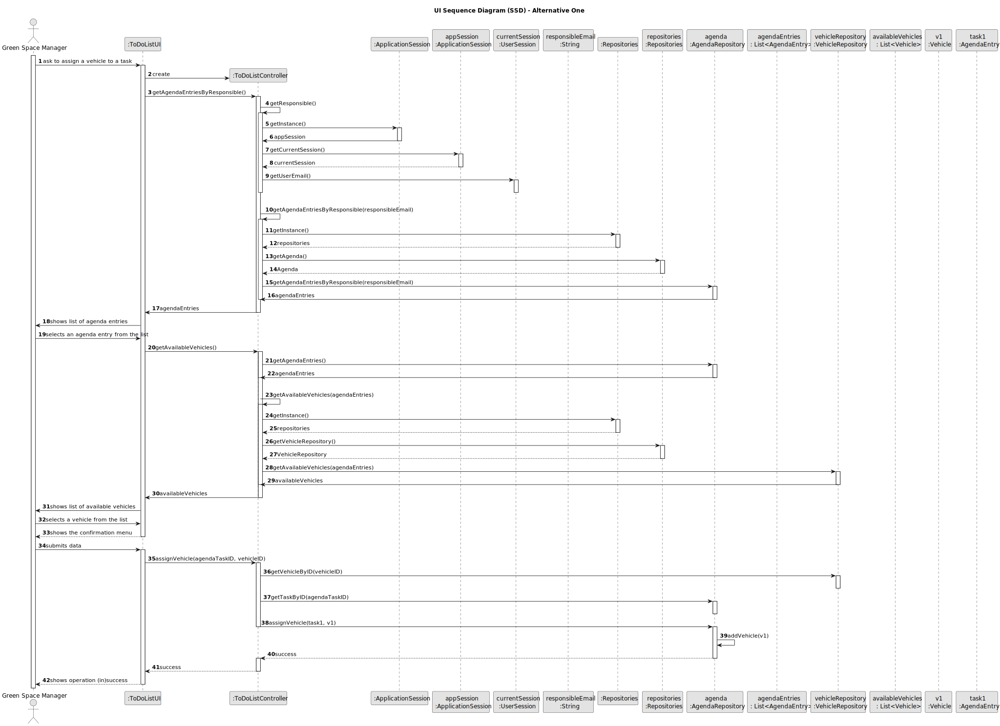
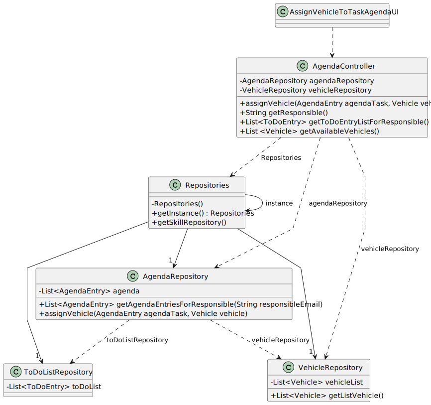

# US026 - Assign One or More Vehicles to Agenda Entry

## 3. Design - User Story Realization

### 3.1. Rationale

| Interaction ID | Question: Which class is responsible for...                 | Answer                | Justification (with patterns)                                                                                                    |
|:---------------|:------------------------------------------------------------|:----------------------|:---------------------------------------------------------------------------------------------------------------------------------|
| Step 1         | ... interacting with the actor?                             | ToDoListUI            | Pure Fabrication: A UI component typically handles user interactions and acts as an interface between the user and the system.   |
|                | ... coordinating the use case?                              | ToDoListController    | Controller: The controller orchestrates the use case by coordinating the interactions between the UI and the domain model.       |
| Step 2         | ... getting the current session instance?                   | ApplicationSession    | Singleton: The session instance is retrieved using the Singleton pattern to ensure a single instance throughout the application. |
|                | ... getting the current user session?                       | ApplicationSession    | Controller: The controller retrieves the current session details to determine the responsible user's email.                      |
| Step 3         | ... getting the responsible user's email?                   | UserSession           | Controller: The controller retrieves the email from the user session to identify the responsible user.                           |
| Step 4         | ... getting the agenda entries by the responsible user?     | Agenda                | Repository: The repository pattern encapsulates the logic for retrieving agenda entries managed by the responsible user.         |
| Step 5         | ... showing the list of agenda entries to the actor?        | ToDoListRepository            | Repository: The repository pattern encapsulates the logic.                                                                       |
| Step 6         | ... getting available vehicles?                             | VehicleRepository     | Repository: The repository pattern encapsulates the logic for retrieving available vehicles based on agenda entries.             |
| Step 7         | ... assigning a vehicle to an agenda task?                  | AgendaRepository                | Repository: The repository pattern encapsulates the logic for assigning a vehicle to an agenda task and updating the repository. |
| Step 8         | ... showing the result of the operation to the actor?       | ToDoListUI            | Pure Fabrication: The UI component presents the outcome of the operation (success or failure) to the user.                       |

### Systematization

According to the taken rationale, the conceptual classes promoted to software classes are:

* ApplicationSession (Singleton)
* UserSession (Entity)

Other software classes (i.e. Pure Fabrication) identified:

* ToDoListController
* ToDoListUI
* VehicleRepository
* ToDoListRepository
* AgendaRepository

## 3.2. Sequence Diagram (SD)

### Full Diagram

This diagram shows the full sequence of interactions between the classes involved in the realization of this user story.

## 3.3. Class Diagram (CD)

