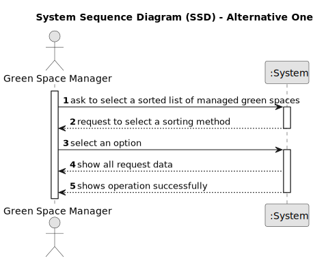

# US027 - Show an organized list of all green spaces managed by manager

## 1. Requirements Engineering

### 1.1. User Story Description

As a GSM, I need to list all green spaces managed by me.

### 1.2. Customer Specifications and Clarifications 

**From the specifications document and client meetings:**

> The list of green spaces must be sorted by size in descending
order (area in hectares should be used)

**From forum:**

> **Question:** Dear client, in this user story you only want to list the Green Spaces manage by the GSM. Due to this, the GSM should be register in the app previusly, isn't it? Which atributes should it have? A  GSM is a collaborator
>
> **Answer:**  yes; the GSM (you can have many) should be registered in the app. GSM is a role that can be played a registered user with the appropriate priviliges;

> **Question:** Good afternoon customer, at us27 it is requested that a GSM can list the green spaces managed by it, does this mean that we can have more than 1 GSM? Taking into account the way we log in to the program, the GSM function is associated with just one person. If we have several people with the GSM function, how do we assign each of them a green space?
>
> **Answer:**  I believe this question has already been answered! The difference between Role/Privilege and User has already been explained.

> **Question:** Dear client, in this user story you only want to list the Green Spaces manage by the GSM. Due to this, the GSM should be register in the app previusly, isn't it? Which atributes should it have? A  GSM is a collaborator?
>
> **Answer:**  Yes, the app can have multiple GSM registered (for instance that can be done during usgin the boostrap);
A collaborator is a person (an employee) that have a name, birthdate, a salary, etc, A GSM is a role played by a collaborator. Depending in the size of the company, you can have a collaborator playing multiple roles like GSM, VFM or HRM or different persons playing the same role like GSM.

> **Question:** Dear client, which info about Green Spaces do you want the GSM see when listing? only the name ?
>
> **Answer:**  Each de team can decide about the aspects related to UX/UI.

### 1.3. Acceptance Criteria 

* **AC1:** Should be at least one green Space on the managed list to be sorted 

* **AC2:** The green space manager should write the sorting algorithm on the configuration file and should be one of the followings names 
in front of "sorting.type", in order to work: "Ascending By Name", "Descending By Name", 
"Insertion Sort", "Bubble Sort" 

### 1.4. Found out Dependencies

* There is a dependency on " US020 - Register a Green Space" as there must be at least one green space in the system so that it can show an organized list.

### 1.5 Input and Output Data

**Input Data:**

* Selected Data
  * Sorting Method in the config file

**Output Data:**

* Organized list of Green Spaces
* Success of the operation

### 1.6. System Sequence Diagram (SSD)

#### Alternative One

