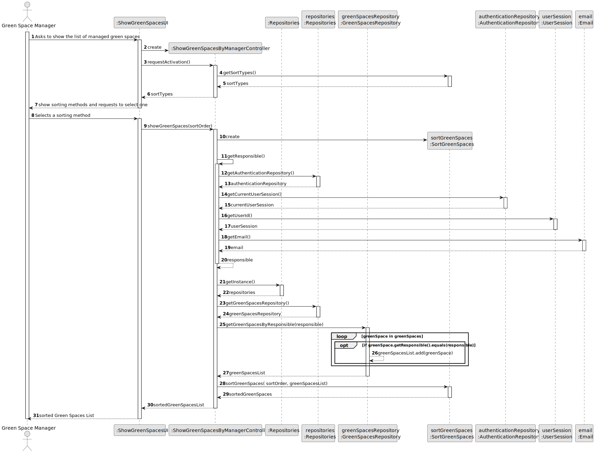

# US027 - Show an organized list of all green spaces managed by manager

## 3. Design - User Story Realization

### 3.1. Rationale

| Interaction ID | Question: Which class is responsible for...                     | Answer                             | Justification (with patterns)                                                                                                                             |
|:---------------|:----------------------------------------------------------------|:-----------------------------------|:----------------------------------------------------------------------------------------------------------------------------------------------------------|
| Step 1         | ... interacting with the actor?                                 | ShowGreenSpacesUI                  | Pure Fabrication: A UI component typically handles user interactions and acts as an interface between the user and the system.                            |
|                | ... coordinating the US?                                        | ShowGreenSpacesByManagerController | Controller: The controller orchestrates the use case by coordinating the interactions between the UI and the domain model.                                |
| Step 2         | ... coordinating with the repositories?                         | ShowGreenSpacesByManagerController | Controller: The controller interacts with repositories to retrieve necessary data and perform business logic.                                             |
|                | ... retrieving the green spaces repository?                     | ShowGreenSpacesByManagerController | Controller: The controller interacts with the repositories to retrieve the necessary data for the use case.                                               |
| Step 3         | ... getting the green spaces managed by the responsible?        | GreenSpacesRepository              | Repository: The repository pattern encapsulates the logic for retrieving data, in this case, green spaces managed by the responsible.                     |
| Step 4         | ... iterating over each green space?                            | GreenSpacesRepository              | Repository: The repository handles the retrieval and manipulation of data, iterating over green spaces.                                                   |
|                | ... determining if a green space is managed by the responsible? | GreenSpacesRepository              | 	Repository: The repository pattern encapsulates the logic for data access and business logic, determining the responsible for each green space.          |
| Step 5         | ... retrieving the sorting types?                               | SortGreenSpaces                    | Pure Fabrication: Encapsulates the logic for sorting data, providing various sorting types.                                                               |
| Step 6         | ... sorting the list of green spaces?                           | SortGreenSpaces                    | Pure Fabrication: Encapsulates the logic for sorting data, sorting the green spaces list as per the selected order.                                       | 
| Step 7         | ... sending the list of sorted green spaces to the actor?       | ShowGreenSpacesUI                  | Pure Fabrication: The UI component is responsible for presenting information to the user and is a separate concern from the domain logic.                 |

### Systematization ##

According to the taken rationale, the conceptual classes promoted to software classes are:

* None

Other software classes (i.e. Pure Fabrication) identified:

* ShowGreenSpacesByManagerController
* ShowGreenSpacesUI
* GreenSpacesRepository
* SortGreenSpaces

## 3.2. Sequence Diagram (SD)

### Full Diagram

This diagram shows the full sequence of interactions between the classes involved in the realization of this user story.

### Split Diagrams

The following diagram shows the same sequence of interactions between the classes involved in the realization of this
user story, but it is split in partial diagrams to better illustrate the interactions between the classes.

It uses Interaction Occurrence (a.k.a. Interaction Use).

**Get Vehicle List Partial SD**

**Generate CheckUp List Partial SD**

## 3.3. Class Diagram (CD)

