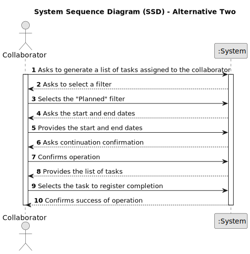

# US028 and US029 - Consulting Tasks and Task Completion Recording

## 1. Requirements Engineering

### 1.1. User Stories Description

**US028**: As a Collaborator, I wish to consult the tasks assigned to me.

**US029**: As a Collaborator, I want to record the completion of a task.

### 1.2. Customer Specifications and Clarifications

**From the specifications document and client meetings:**

> The system should prompt all the tasks assigned to the collaborator.

> It is possible that no tasks are assigned to the collaborator.

> The status of the task must be changed.

> The real end time of task must be updated

**From forum:**

> **Question:**  
In the US28, the tasks consulted will be the ones that were assigned to the team/teams that collaborator is in, right?
Why do we need to show a list of green spaces? Are we assuming that one collaborator could work in 2 different parks?
What should be the output? The description of the task + the team (if the first sentence is correct)?
Thank you.
>
> **Answer:** 1) right ; 2) Yes, a collaborator can work in multiples green spaces ; 3) Development teams can decide about the UX/UI related aspects of the solution.

> **Question:** As a Collaborator, I want to record the completion of a task."
This "record" refers to the act of only changing the status of the task, or do we want to save a list of the completed tasks within each Collaborator?
>
> **Answer:** It means to record that a task was completed (changing the status) with the finish time.

> **Question:** It means to record that a task was completed (changing the status) with the finish time.
>
> **Answer:** The ones assigned to him. He can filter by the different values the status of the status, like planned, executed, canceled ...

> **Question:** Can an employee record more than one completed task at a time?
>
> **Answer:** It's a matter of UX/UI, each dev team can decide about it.

### 1.3. Acceptance Criteria

* **AC1:** The list of green spaces must be sorted by date, starting with the first to be performed.
* **AC2:** The Collaborator should be able to filter the results by the status of the task.
* **AC3:** Only by filtering by "Planned" tasks, the collaborator is able to register its completion.
* **AC4:** If there are no tasks assigned to the collaborator a message should inform them of this.

### 1.4. Found out Dependencies

* There is a dependency on "US003 - Register a collaborator" once a collaborator must exist.
* There is a dependency on "US05 - Generate a team proposal automatically" once there must be a Team associated with the
  collaborator.
* There is a dependency on "US020 - Register a Green Space" once a green space must exist.
* There is a dependency on "US021 - Adding a To-Do List Entry for Green Space Management" once a task must be associated with a green space.
* There is a dependency on "US022 - Add a new entry in the Agenda" once a task must be associated with an agenda.
* There is a dependency on "US023 -  Assign a Team to an entry in the Agenda" once a team must be associated with an agenda.

### 1.5 Input and Output Data

**Input Data:**

* Chosen status of task
* Confirmation of task completion
* Selection of task to register completion

**Output Data:**

* List of tasks
* Errors/warnings messages
* Success of the operation

### 1.6. System Sequence Diagram (SSD)

#### Alternative One

