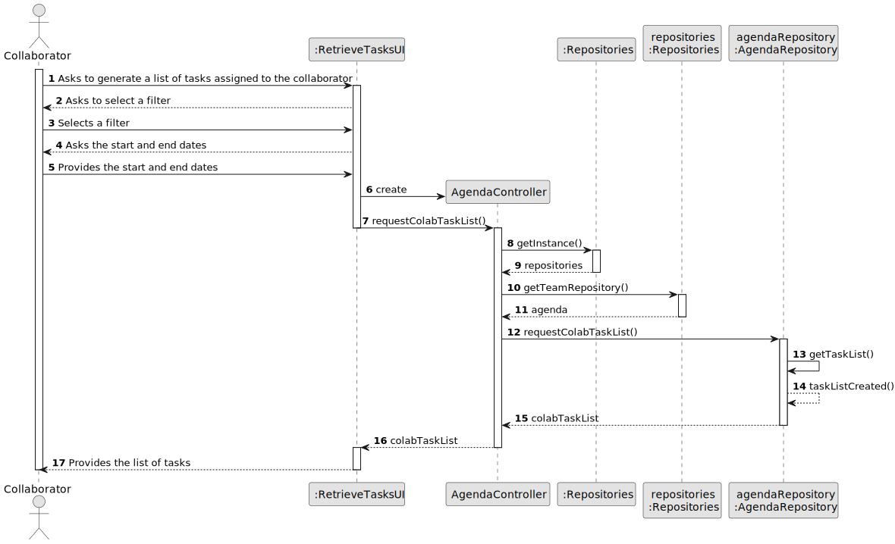
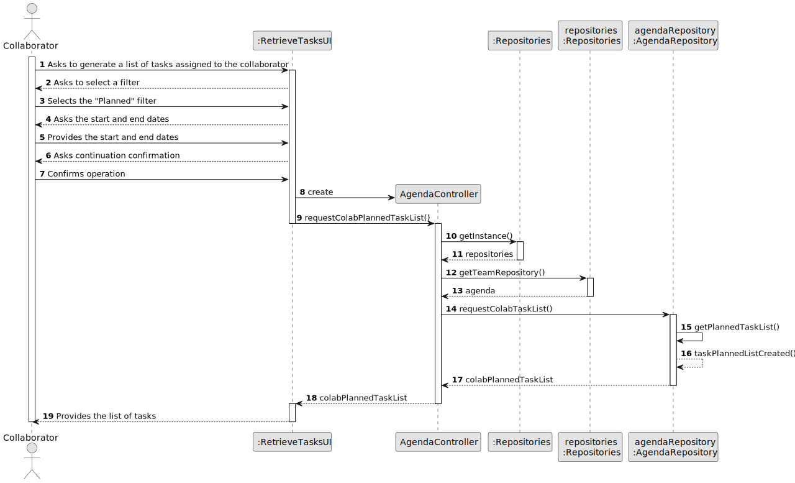
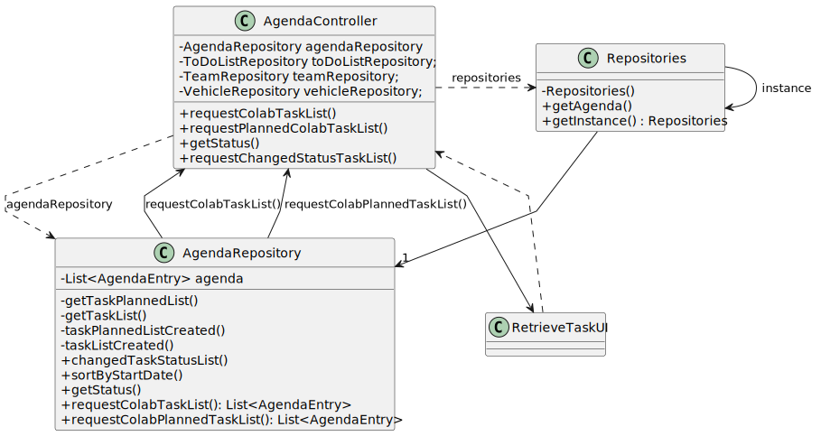

# US028 and US029 - Consulting Tasks and Task Completion

## 3. Design - User Story Realization

### 3.1. Rationale

#### **Version 1**

| Interaction ID | Question: Which class is responsible for...                    | Answer              | Justification (with patterns)                                                                                                                     |
|:---------------|:---------------------------------------------------------------|:--------------------|:--------------------------------------------------------------------------------------------------------------------------------------------------|
| Step 1         | ... interacting with the actor?                                | RetrieveTasksUI     | **Pure Fabrication**: A UI component handles user interactions and acts as an interface between the user and the system.                          |
|                | ... coordinating the use case?                                 | AgendaController    | **Controller**: The controller orchestrates the use case by coordinating interactions between the UI and the domain model.                        |
| Step 2         | ... coordinating with the repositories?                        | AgendaController    | **Controller**: The controller interacts with repositories to retrieve necessary data and perform business logic.                                 |
|                | ... retrieving the agenda repository?                          | AgendaController    | **Controller**: The controller interacts with the repositories to retrieve the necessary data for the use case.                                   |
| Step 3         | ... getting a singleton instance of the repository?            | RepositorySingleton | **Singleton**: Provides a single instance of the repositories, ensuring a global access point.                                                    |
| Step 4         | ... iterating over each task?                                  | AgendaRepository    | **Repository**: The repository handles the retrieval and manipulation of data, iterating over tasks.                                              |
|                | ... determining which tasks are assigned to the collaborator?  | AgendaRepository    | **Repository**: The repository pattern encapsulates the logic for data access and business logic, determining tasks assigned to the collaborator. |
| Step 5         | ... retrieving the list of tasks assigned to the collaborator? | AgendaRepository    | **Repository**: The repository pattern encapsulates the logic for data access, retrieving the list of tasks assigned to the collaborator.         |
| Step 6         | ... sending the list of tasks to the actor?                    | RetrieveTasksUI     | **Pure Fabrication**: The UI component is responsible for presenting information to the user and is a separate concern from the domain logic.     |

#### **Version 2**

| Interaction ID | Question: Which class is responsible for...                            | Answer              | Justification (with patterns)                                                                                                                     |
|:---------------|:-----------------------------------------------------------------------|:--------------------|:--------------------------------------------------------------------------------------------------------------------------------------------------|
| Step 1         | ... interacting with the actor?                                        | RetrieveTasksUI     | **Pure Fabrication**: A UI component handles user interactions and acts as an interface between the user and the system.                          |
| Step 2         | ... asking the actor to select a filter?                               | RetrieveTasksUI     | **Pure Fabrication**: The UI component handles user interactions, prompting the user to select a filter.                                          |
| Step 3         | ... asking for start and end dates?                                    | RetrieveTasksUI     | **Pure Fabrication**: The UI component is responsible for gathering necessary input from the user, such as dates.                                 |
| Step 4         | ... confirming continuation of the operation?                          | RetrieveTasksUI     | **Pure Fabrication**: The UI component handles user interactions and confirmations, ensuring the user wants to proceed with the operation.        |
| Step 5         | ... coordinating the use case?                                         | AgendaController    | **Controller**: The controller orchestrates the use case by coordinating interactions between the UI and the domain model.                        |
| Step 6         | ... coordinating with the repositories?                                | AgendaController    | **Controller**: The controller interacts with repositories to retrieve necessary data and perform business logic.                                 |
| Step 7         | ... getting a singleton instance of the repository?                    | RepositorySingleton | **Singleton**: Provides a single instance of the repositories, ensuring a global access point.                                                    |
| Step 8         | ... retrieving the agenda repository?                                  | AgendaController    | **Controller**: The controller interacts with the repositories to retrieve the necessary data for the use case.                                   |
| Step 9         | ... retrieving the list of planned tasks assigned to the collaborator? | AgendaRepository    | **Repository**: The repository pattern encapsulates the logic for data access, retrieving the list of planned tasks assigned to the collaborator. |
| Step 10        | ... sending the planned task list to the actor?                        | RetrieveTasksUI     | **Pure Fabrication**: The UI component is responsible for presenting information to the user and is a separate concern from the domain logic.     |

### Systematization ##

According to the taken rationale, the conceptual classes promoted to software classes are:

* None

Other software classes (i.e. Pure Fabrication) identified:

* RetrieveTasksUI
* AgendaController
* AgendaRepository

## 3.2. Sequence Diagram (SD)

### Full Diagram

This diagram shows the full sequence of interactions between the classes involved in the realization of this user story.

#### Version 1

#### Version 2

## 3.3. Class Diagram (CD)

