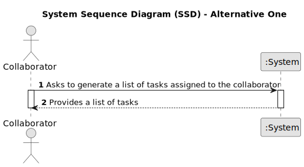

# US028 - Consulting Tasks

## 1. Requirements Engineering

### 1.1. User Story Description

As a Collaborator, I wish to consult the tasks assigned to me.

### 1.2. Customer Specifications and Clarifications 

**From the specifications document and client meetings:**

>	The system should prompt all the tasks assigned to the collaborator. 

>	It is possible that no tasks are assigned to the collaborator.

**From forum:**

> **Question:** 
>
> **Answer:**  

> **Question:** 
>
> **Answer:**  

> **Question:** 
>
> **Answer:** 

> **Question:** 
>
> **Answer:** 

### 1.3. Acceptance Criteria 

* **AC1:** The list of green spaces must be sorted by date, starting with the first to be performed.
* **AC2:** If there are no tasks assigned to the collaborator a message should inform them of this.
* **AC3:** The list should include the name of the park, date and description of the task.

### 1.4. Found out Dependencies

* There is a dependency on "US003 - Register a collaborator" once a collaborator must exist.
* There is a dependency on "US05 - Generate a team proposal automatically" once there must be a Team associated with the collaborator.
* There is a dependency on "US020 - Register a Green Space" once a green space must exist.
* There is a dependency on "US021 - TO BE DEFINED..." once a task must be associated with a green space.
* There is a dependency on "US022 - TO BE DEFINED..." once a task must be associated with an agenda.
* There is a dependency on "US023 - TO BE DEFINED..." once a team must be associated with an agenda.

### 1.5 Input and Output Data

**Input Data:**

* The system automatically retrieves the list of tasks assigned to a collaborator without requiring any manual input.

**Output Data:**

* List of tasks
* Errors/warnings messages
* Success of the operation

### 1.6. System Sequence Diagram (SSD)

#### Alternative One

