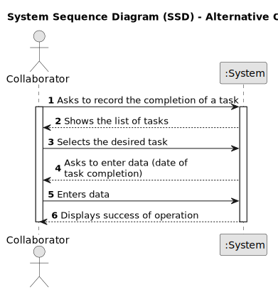

# US029 - Task Completion Recording

## 1. Requirements Engineering

### 1.1. User Story Description

As a Collaborator, I want to record the completion of a task.

### 1.2. Customer Specifications and Clarifications 

**From the specifications document and client meetings:**

>	The status of the task must be changed.

>	It is possible that no tasks are assigned to the collaborator.

**From forum:**

> **Question:** 
>
> **Answer:**  

> **Question:** 
>
> **Answer:** 

> **Question:** 
>
> **Answer:** 

> **Question:** 
>
> **Answer:** 

### 1.3. Acceptance Criteria 

* **AC1:** If there are no tasks assigned to the collaborator a message should inform them of this.
* **AC2:** The list of vehicles needing overhauling should contain all the vehicles' info.
* **AC3:** The list should include vehicles that have either exceeded the maintenance frequency limit or are within 5% of reaching it.

### 1.4. Found out Dependencies

* There is a dependency on "US006 - Registering Vehicles" as there must be at least one vehicle in the system so that it can check the need for a check-up.

### 1.5 Input and Output Data

**Input Data:**

* Typed data:
    * the date the task was completed 

* Selected data:
    * a task from a list

**Output Data:**

* Confirmation menu
* Success of the operation
* Errors/warnings messages

### 1.6. System Sequence Diagram (SSD)

#### Alternative One

