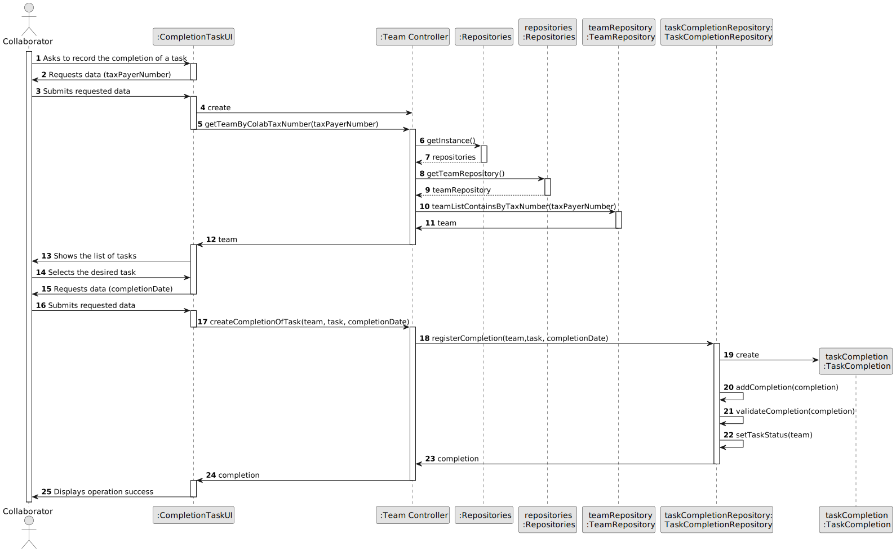
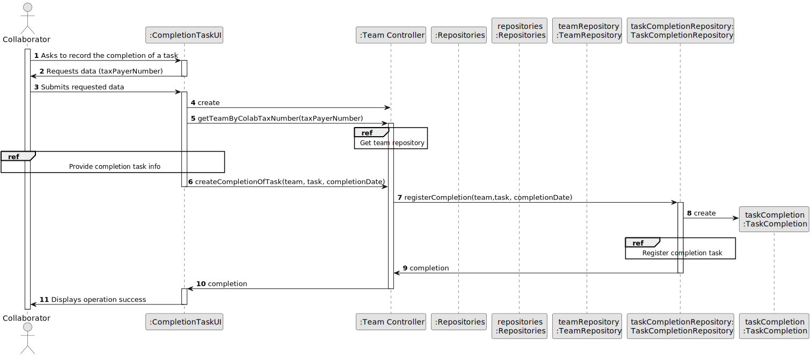
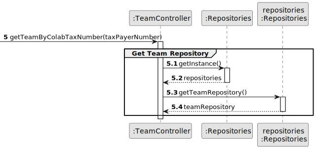
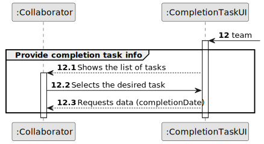
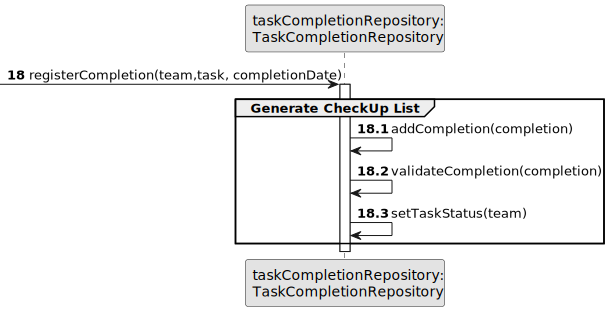

# US029 - Task Completion Recording

## 3. Design - User Story Realization

### 3.1. Rationale

| Interaction ID | Question: Which class is responsible for...           | Answer                   | Justification (with patterns)                                                                                                               |
|:---------------|:------------------------------------------------------|:-------------------------|:--------------------------------------------------------------------------------------------------------------------------------------------|
| Step 1         | ... interacting with the actor?                       | CompletionTaskUI         | Pure Fabrication: A UI component typically handles user interactions and acts as an interface between the user and the system.              |
|                | ... coordinating the use case?                        | TeamController           | Controller: The controller orchestrates the use case by coordinating the interactions between the UI and the domain model.                  |
| Step 2         | ... coordinating with the repositories?               | TeamController           | Controller: The controller interacts with repositories to retrieve necessary data and perform business logic.                               |
|                | ... retrieving the team repository?                   | TeamController           | Controller: The controller interacts with the repositories to retrieve the necessary data for the use case.                                 |
| Step 3         | ... getting the team by collaborator tax number?      | TeamRepository           | Repository: The repository pattern encapsulates the logic for retrieving data, in this case, obtaining the team by collaborator tax number. |
| Step 4         | ... getting the list of tasks for the team?           | TaskCompletionRepository | Repository: The repository handles the retrieval and manipulation of data, in this case, retrieving the list of tasks for the team.         |
| Step 5         | ... retrieving the data for the selected task?        | TaskCompletionRepository | Repository: The repository pattern encapsulates the logic for data access, retrieving the necessary data for the selected task.             |
| Step 6         | ... registering the completion of the task?           | TaskCompletionRepository | Repository: The repository pattern encapsulates the logic for data access and manipulation, registering the completion of the task.         |
|                | ... validating the completion data?                   | TaskCompletionRepository | Repository: The repository pattern encapsulates the logic for data access and validation, ensuring data integrity during completion.        | 
|                | ... updating the task status?                         | TaskCompletionRepository | Repository: The repository pattern encapsulates the logic for data access and manipulation, updating the task status after completion.      | 
| Step 7         | ... creating an instance of TaskCompletion?           | TaskCompletion           | Entity: The TaskCompletion class represents an entity within the system, capturing the completion data of a task.                           |
| Step 8         | ... sending the completion confirmation to the actor? | CompletionTaskUI         | Pure Fabrication: The UI component is responsible for presenting information to the user and is a separate concern from the domain logic.   |

### Systematization ##

According to the taken rationale, the conceptual classes promoted to software classes are:

* TaskCompletion

Other software classes (i.e. Pure Fabrication) identified:

* TeamController
* CompletionTaskUI
* TaskCompletionRepository

## 3.2. Sequence Diagram (SD)

### Full Diagram

This diagram shows the full sequence of interactions between the classes involved in the realization of this user story.

### Split Diagrams

The following diagram shows the same sequence of interactions between the classes involved in the realization of this
user story, but it is split in partial diagrams to better illustrate the interactions between the classes.

It uses Interaction Occurrence (a.k.a. Interaction Use).

**Get Vehicle Team Repository Partial SD**

**Provide Completion Task Info Partial SD**

**Register Completion Task Partial SD**

## 3.3. Class Diagram (CD)

